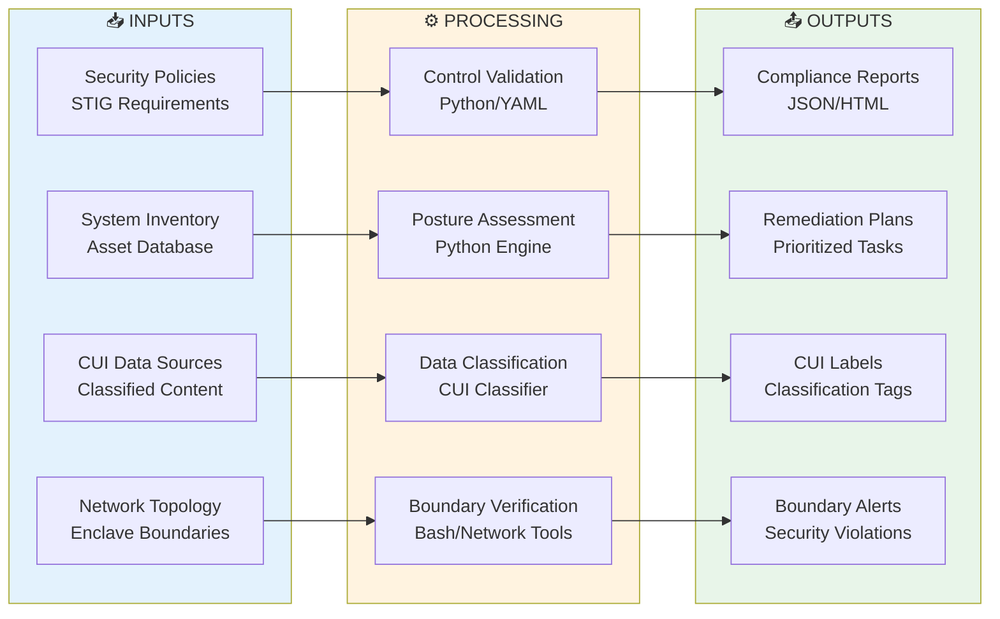
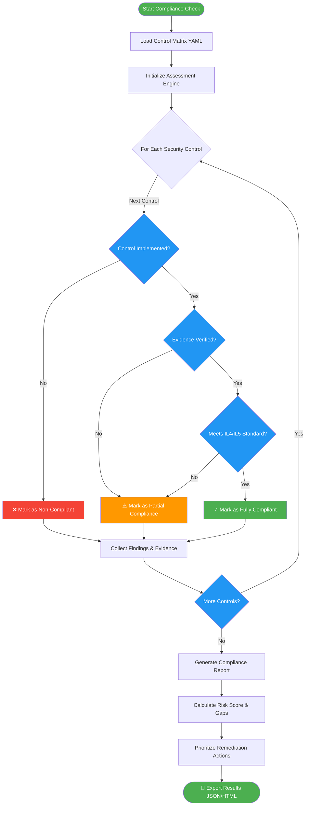
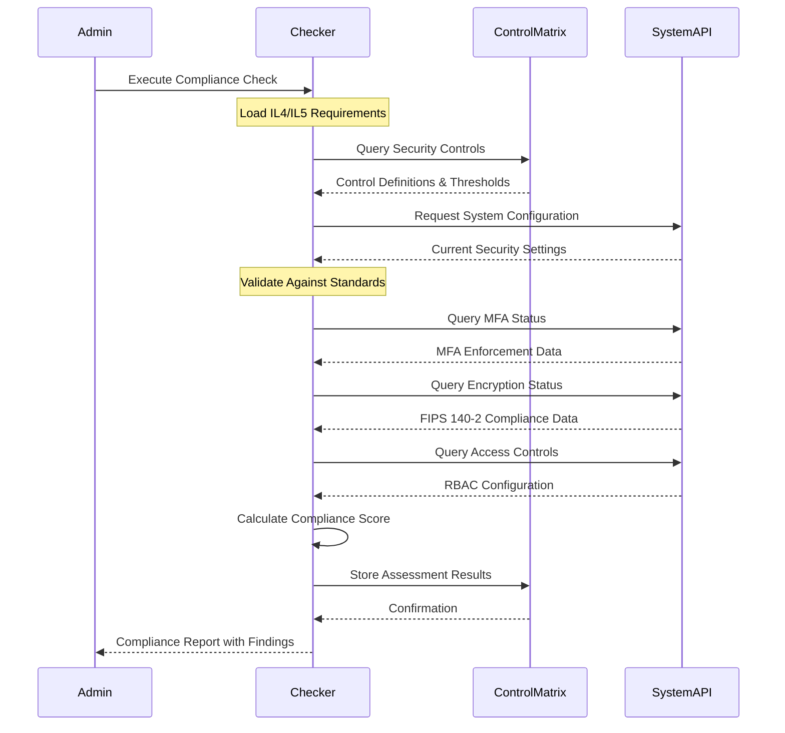

# 🔐 IL4–IL5 Compliance Automation Module

   

Comprehensive security compliance automation suite for DoD Impact Level 4 and Impact Level 5 requirements, enabling automated validation of security controls, CUI data classification, enclave boundary verification, and continuous compliance monitoring across GCC and NSC environments.

| Resource | Link |
|----------|------|
| NIST SP 800-171 | https://csrc.nist.gov/publications/detail/sp/800-171/rev-2/final |
| DoD Cloud Computing SRG | https://public.cyber.mil/dccs/dccs-documents/ |
| CMMC Framework | https://www.acq.osd.mil/cmmc/ |
| GitHub Repository | https://github.com/Suren-Jewels/Scripts-Toolkit |

---

## 📊 Current IL4–IL5 Compliance Status
```
IL4 Control Implementation      [███████████████████░░░░░] 82% (123/150) ✓
IL5 Control Implementation      [████████████████░░░░░░░░] 68% (102/150) ⚠
────────────────────────────────────────────────────────────────────────────
Access Controls (NIST AC Family):
  Multi-Factor Authentication   [████████████████████████] 100%          ✓
  Role-Based Access Control     [███████████████████████░] 95%           ✓
  Least Privilege Enforcement   [██████████████████████░░] 89%           ✓
────────────────────────────────────────────────────────────────────────────
Data Protection (NIST SC Family):
  FIPS 140-2 Encryption         [████████████████████░░░░] 85%           ✓
  CUI Data Classification       [███████████████████░░░░░] 78%           ⚠
  Data-at-Rest Protection       [███████████████████████░] 92%           ✓
────────────────────────────────────────────────────────────────────────────
Audit & Accountability (NIST AU):
  Comprehensive Logging         [████████████████████░░░░] 81%           ✓
  Log Retention Compliance      [███████████████████████░] 94%           ✓
  Security Event Monitoring     [██████████████████░░░░░░] 73%           ⚠
────────────────────────────────────────────────────────────────────────────
Boundary Protection:
  GCC Enclave Isolation         [████████████████████████] 100%          ✓
  NSC Network Segmentation      [███████████████████████░] 96%           ✓
────────────────────────────────────────────────────────────────────────────
Device Posture Validation       [██████████████████░░░░░░] 76%           ⚠
────────────────────────────────────────────────────────────────────────────
Monthly Trend:  ▃▅▆▆▇▇█  (Improving)

Risk Distribution:
  Critical: 4  |  High: 12  |  Medium: 28  |  Low: 19  |  Passed: 87
```

---

## 🗂️ Module Architecture

```mermaid
graph TD
    Root[[🔐 IL4-IL5 Compliance Module]]
    
    Root --> Checkers[[🔍 Compliance Checkers]]
    Root --> Classifiers[[📋 Data Classification]]
    Root --> Auditors[[🔎 Security Auditors]]
    Root --> Configs[[⚙️ Configuration Files]]
    
    Checkers --> File1[il4-compliance-checker.py]
    Checkers --> File2[il5-compliance-checker.py]
    Checkers --> File3[il-posture-validator.py]
    
    Classifiers --> File4[cui-data-classifier.py]
    Classifiers --> File5[gcc-nsc-boundary-check.sh]
    
    Auditors --> File6[mfa-enforcement-audit.ps1]
    Auditors --> File7[encryption-validator.sh]
    Auditors --> File8[access-control-audit.py]
    
    Configs --> Config1[il4-control-matrix.yaml]
    Configs --> Config2[il5-control-matrix.yaml]
    Configs --> Config3[cui-handling-procedures.md]
    
    File1 -.references.-> Config1
    File2 -.references.-> Config2
    File4 -.references.-> Config3
    File6 -.references.-> Config1
    File7 -.references.-> Config1
    File8 -.references.-> Config2
    
    style Checkers fill:#BBDEFB
    style Classifiers fill:#FFE0B2
    style Auditors fill:#E1BEE7
    style Configs fill:#FFF9C4
    
    style File1 fill:#2196F3,color:#fff
    style File2 fill:#2196F3,color:#fff
    style File3 fill:#2196F3,color:#fff
    style File4 fill:#FF9800,color:#fff
    style File5 fill:#FF9800,color:#fff
    style File6 fill:#9C27B0,color:#fff
    style File7 fill:#9C27B0,color:#fff
    style File8 fill:#9C27B0,color:#fff
    
    style Config1 fill:#FBC02D
    style Config2 fill:#FBC02D
    style Config3 fill:#FBC02D
```


---

## 🔄 IL4–IL5 Compliance Validation Workflow


---

## ⚙️ Compliance Validation Logic Flow


---

## 🔗 Security Control Validation Integration


---

## 📂 File Reference Table

<table>
  <thead>
    <tr>
      <th>File</th>
      <th>Type</th>
      <th>Purpose</th>
      <th>Impact Level</th>
    </tr>
  </thead>
  <tbody>
    <tr style="background-color: #E3F2FD;">
      <td><code>il4-compliance-checker.py</code></td>
      <td></td>
      <td>Validates IL4 security controls against NIST SP 800-171 requirements and generates compliance reports</td>
      <td></td>
    </tr>
    <tr style="background-color: #E3F2FD;">
      <td><code>il5-compliance-checker.py</code></td>
      <td></td>
      <td>Validates IL5 security controls with enhanced requirements for classified information handling</td>
      <td></td>
    </tr>
    <tr style="background-color: #E3F2FD;">
      <td><code>il-posture-validator.py</code></td>
      <td></td>
      <td>Validates device security posture including patch levels, EDR status, and configuration compliance</td>
      <td></td>
    </tr>
    <tr style="background-color: #FFF3E0;">
      <td><code>cui-data-classifier.py</code></td>
      <td></td>
      <td>Scans and classifies Controlled Unclassified Information using pattern matching and ML algorithms</td>
      <td></td>
    </tr>
    <tr style="background-color: #FFF3E0;">
      <td><code>gcc-nsc-boundary-check.sh</code></td>
      <td></td>
      <td>Validates network boundary controls between GCC and NSC enclaves, ensuring proper isolation</td>
      <td></td>
    </tr>
    <tr style="background-color: #F3E5F5;">
      <td><code>mfa-enforcement-audit.ps1</code></td>
      <td></td>
      <td>Audits multi-factor authentication enforcement across Azure AD and on-premises Active Directory</td>
      <td></td>
    </tr>
    <tr style="background-color: #F3E5F5;">
      <td><code>encryption-validator.sh</code></td>
      <td></td>
      <td>Validates FIPS 140-2 compliant encryption for data at rest and in transit across systems</td>
      <td></td>
    </tr>
    <tr style="background-color: #F3E5F5;">
      <td><code>access-control-audit.py</code></td>
      <td></td>
      <td>Audits role-based access controls, least privilege implementation, and separation of duties</td>
      <td></td>
    </tr>
    <tr style="background-color: #FFF9C4;">
      <td><code>il4-control-matrix.yaml</code></td>
      <td></td>
      <td>Defines IL4 security control requirements, validation criteria, and compliance thresholds</td>
      <td></td>
    </tr>
    <tr style="background-color: #FFF9C4;">
      <td><code>il5-control-matrix.yaml</code></td>
      <td></td>
      <td>Defines IL5 enhanced security control requirements with stricter validation rules</td>
      <td></td>
    </tr>
    <tr style="background-color: #FFF9C4;">
      <td><code>cui-handling-procedures.md</code></td>
      <td></td>
      <td>Comprehensive guidelines for CUI data identification, marking, handling, and disposal procedures</td>
      <td></td>
    </tr>
  </tbody>
</table>

---

This module provides **automated security control validation** for **DoD Impact Level 4 and 5** workflows, enabling continuous compliance monitoring, CUI data protection, and risk-based remediation prioritization across government cloud computing (GCC) and national security cloud (NSC) environments.

---

**Built for DoD Impact Level Compliance | Maintained by Suren Jewels**

[](https://github.com/Suren-Jewels)
