# 🔐 IL4–IL5 Compliance Automation Module

   

A modular, analytics-driven automation suite for **IL4/IL5 compliance**, covering posture validation, RBAC auditing, encryption checks, CUI classification, and enclave boundary validation. Engineered for **repeatable, auditable, and scalable** compliance workflows across DoD-aligned environments.

## 🔗 Quick Links

| Resource | Link |
|----------|------|
| **DoD Impact Levels** | https://public.cyber.mil |
| **CUI Program** | https://www.archives.gov/cui |
| **NIST 800-171** | https://csrc.nist.gov |
| **Suren Jewels GitHub** | https://github.com/Suren-Jewels |

---

## 📊 Current Compliance Status

### Control Implementation Progress
```
IL4 Controls (140/170):  ████████████████████░░░░  82% ✓
IL5 Controls (139/240):  ██████████████░░░░░░░░░░  58% ⚠

Security Posture:
├─ Encryption:          ████████████████████████ 100% ✓
├─ Firewall:            ███████████████████████░  95% ✓
├─ Antivirus:           ██████████████████████░░  90% ✓
├─ MFA:                 █████████████████████░░░  85% ✓
└─ OS Patching:         ███████████████████░░░░░  75% ⚠

CUI Classification:     ████████████████████░░░░  78% ⚠

Boundary Validation:
├─ GCC High:            ████████████████████████ 100% ✓
├─ DoD Cloud:           ███████████████████████░  95% ✓
└─ NSC:                 ██████████████████████░░  90% ✓
```

### Monthly Trend (Last 6 Months)
```
IL4: ▁▃▅▆▇█  (Improving)
IL5: ▂▃▄▅▅▆  (Steady Growth)
```

### Risk Distribution
```
Critical:  ██░░░░░░░░░░░░░░░░░░░░░░  8%  ❌
High:      █████░░░░░░░░░░░░░░░░░░░ 22%  ⚠
Medium:    ████████████░░░░░░░░░░░░ 48%  ⚠
Low:       █████░░░░░░░░░░░░░░░░░░░ 22%  ✓
```

---

## 🗂️ Module Architecture

```mermaid
graph TD
    Root[🔐 IL4-IL5 Compliance Module]
    
    %% Script Categories
    Root --> Checkers[📋 Compliance Checkers]
    Root --> Validators[✅ Validators]
    Root --> Auditors[🔍 Auditors]
    Root --> Config[⚙️ Configuration Files]
    
    %% Checkers
    Checkers --> IL4Check[il4-compliance-checker.py]
    Checkers --> IL5Check[il5-compliance-checker.py]
    
    %% Validators
    Validators --> CUIClass[cui-data-classifier.py]
    Validators --> BoundCheck[gcc-nsc-boundary-check.sh]
    Validators --> PostureVal[il-posture-validator.py]
    Validators --> EncryptVal[encryption-validator.sh]
    
    %% Auditors
    Auditors --> MFAAudit[mfa-enforcement-audit.ps1]
    Auditors --> AccessAudit[access-control-audit.py]
    
    %% Configuration
    Config --> IL4Matrix[il4-control-matrix.yaml]
    Config --> IL5Matrix[il5-control-matrix.yaml]
    Config --> CUIProc[cui-handling-procedures.md]
    
    %% Connections
    IL4Check -.->|references| IL4Matrix
    IL5Check -.->|references| IL5Matrix
    CUIClass -.->|references| CUIProc
    
    %% Styling
    classDef checkerStyle fill:#2196F3,stroke:#1976D2,color:#fff
    classDef validatorStyle fill:#FF9800,stroke:#F57C00,color:#fff
    classDef auditorStyle fill:#9C27B0,stroke:#7B1FA2,color:#fff
    classDef configStyle fill:#FFC107,stroke:#FFA000,color:#000
    
    class IL4Check,IL5Check checkerStyle
    class CUIClass,BoundCheck,PostureVal,EncryptVal validatorStyle
    class MFAAudit,AccessAudit auditorStyle
    class IL4Matrix,IL5Matrix,CUIProc configStyle
```


---

## 🔄 Compliance Workflow


---

## ⚙️ Validation Logic Flow

```mermaid
flowchart TD
    Start([🚀 Start Validation]) --> LoadMatrix[📋 Load Control Matrix]
    LoadMatrix --> LoadImpl[📥 Load Implemented Controls]
    LoadImpl --> CompareLoop{🔍 Compare Each Control}
    
    CompareLoop -->|Control Found| CheckStandard{📏 Meets Standard?}
    CompareLoop -->|Control Missing| MarkMissing[⚠️ Flag as Missing]
    
    CheckStandard -->|Yes| MarkPass[✅ Mark as Compliant]
    CheckStandard -->|No| MarkFail[❌ Mark as Non-Compliant]
    
    MarkPass --> CheckMore{More Controls?}
    MarkFail --> CheckMore
    MarkMissing --> CheckMore
    
    CheckMore -->|Yes| CompareLoop
    CheckMore -->|No| CheckExtra{🔎 Extra Controls?}
    
    CheckExtra -->|Yes| MarkExtra[⚠️ Flag Extra Controls]
    CheckExtra -->|No| GenerateReport
    MarkExtra --> GenerateReport
    
    GenerateReport[📊 Generate Report] --> CalcScore[📈 Calculate Compliance Score]
    CalcScore --> OutputResults[📤 Output Results]
    OutputResults --> End([✓ Complete])
    
    style Start fill:#4CAF50,stroke:#2E7D32,color:#fff
    style End fill:#4CAF50,stroke:#2E7D32,color:#fff
    style MarkPass fill:#4CAF50,stroke:#2E7D32,color:#fff
    style MarkFail fill:#F44336,stroke:#C62828,color:#fff
    style MarkMissing fill:#FF9800,stroke:#F57C00,color:#fff
    style MarkExtra fill:#FF9800,stroke:#F57C00,color:#fff
    style LoadMatrix fill:#2196F3,stroke:#1976D2,color:#fff
    style LoadImpl fill:#2196F3,stroke:#1976D2,color:#fff
    style GenerateReport fill:#2196F3,stroke:#1976D2,color:#fff
    style CalcScore fill:#2196F3,stroke:#1976D2,color:#fff
```


---

## 🔗 System Integration


---

## 📂 File Reference Table

<table>
<thead>
<tr>
<th>File</th>
<th>Type</th>
<th>Purpose</th>
<th>Impact Level</th>
</tr>
</thead>
<tbody>
<tr style="background-color: #E3F2FD;">
<td><code>il4-compliance-checker.py</code></td>
<td></td>
<td>Validates IL4 controls against baseline</td>
<td></td>
</tr>
<tr style="background-color: #FCE4EC;">
<td><code>il5-compliance-checker.py</code></td>
<td></td>
<td>Validates IL5 controls against baseline</td>
<td></td>
</tr>
<tr style="background-color: #FFF9C4;">
<td><code>cui-data-classifier.py</code></td>
<td></td>
<td>Classifies CUI vs NON-CUI content</td>
<td></td>
</tr>
<tr style="background-color: #F3E5F5;">
<td><code>gcc-nsc-boundary-check.sh</code></td>
<td></td>
<td>Validates GCC/NSC enclave boundaries</td>
<td></td>
</tr>
<tr style="background-color: #E8F5E9;">
<td><code>il-posture-validator.py</code></td>
<td></td>
<td>Validates device posture: encryption, firewall, AV, MFA, OS</td>
<td></td>
</tr>
<tr style="background-color: #FCE4EC;">
<td><code>mfa-enforcement-audit.ps1</code></td>
<td></td>
<td>Audits MFA enforcement across users</td>
<td></td>
</tr>
<tr style="background-color: #FFF3E0;">
<td><code>encryption-validator.sh</code></td>
<td></td>
<td>Validates FIPS-approved encryption</td>
<td></td>
</tr>
<tr style="background-color: #E0F7FA;">
<td><code>access-control-audit.py</code></td>
<td></td>
<td>Audits RBAC and privilege assignments</td>
<td></td>
</tr>
<tr style="background-color: #EEEEEE;">
<td><code>il4-control-matrix.yaml</code></td>
<td></td>
<td>IL4 control requirements baseline</td>
<td></td>
</tr>
<tr style="background-color: #EEEEEE;">
<td><code>il5-control-matrix.yaml</code></td>
<td></td>
<td>IL5 control requirements baseline</td>
<td></td>
</tr>
<tr style="background-color: #EEEEEE;">
<td><code>cui-handling-procedures.md</code></td>
<td></td>
<td>CUI handling guidelines</td>
<td></td>
</tr>
</tbody>
</table>

---

## 🏁 Summary

This module provides **end-to-end IL4/IL5 compliance automation**, enabling consistent, auditable, and repeatable workflows across DoD-aligned environments. It integrates posture validation, RBAC auditing, encryption checks, CUI classification, and enclave boundary validation into a unified, modular toolkit designed for operational excellence in high-security contexts.

---

**Built for DoD Impact Level Compliance | Maintained by Suren Jewels**

[](https://github.com/Suren-Jewels)
