# 🏛️ FedRAMP Compliance Automation Module
  
  
  

> **A modular, analytics‑driven automation suite for IL4/IL5 compliance**, covering posture validation, RBAC auditing, encryption checks, CUI classification, and enclave boundary validation. Engineered for **repeatable, auditable, and scalable** compliance workflows across DoD‑aligned environments.

---

## 🔗 Quick Links  
| Resource | URL |
|----------|-----|
| **DoD Impact Levels Overview** | https://public.cyber.mil |
| **CUI Program** | https://www.archives.gov/cui |
| **NIST 800‑171** | https://csrc.nist.gov |
| **Suren Jewels GitHub** | https://github.com/Suren-Jewels |

---

## 🧩 Capability Matrix

<table>
<thead>
<tr>
<th width="25%">Capability</th>
<th width="50%">Description</th>
<th width="25%">Status</th>
</tr>
</thead>
<tbody>
<tr style="background-color: #E3F2FD;">
<td><strong>🛡️ IL4/IL5 Control Validation</strong></td>
<td>Validates implemented controls against IL4/IL5 matrices, detects missing/extra/misaligned controls using YAML‑based control matrices</td>
<td><code>✅ ACTIVE</code></td>
</tr>
<tr style="background-color: #FFF9C4;">
<td><strong>📄 CUI Classification</strong></td>
<td>Identifies CUI vs NON‑CUI content with automated labeling and downstream workflow integration</td>
<td><code>✅ ACTIVE</code></td>
</tr>
<tr style="background-color: #F3E5F5;">
<td><strong>🌐 Boundary Validation</strong></td>
<td>Validates GCC / GCC High / DoD / NSC enclave boundaries, ensures tenant/endpoint compliance</td>
<td><code>✅ ACTIVE</code></td>
</tr>
<tr style="background-color: #E8F5E9;">
<td><strong>💻 Device Posture Validation</strong></td>
<td>Validates encryption, firewall, AV, MFA, OS support against IL4/IL5 posture requirements</td>
<td><code>✅ ACTIVE</code></td>
</tr>
<tr style="background-color: #FCE4EC;">
<td><strong>🔑 MFA Enforcement Auditing</strong></td>
<td>Audits MFA enforcement across user populations, detects non‑compliant accounts</td>
<td><code>✅ ACTIVE</code></td>
</tr>
<tr style="background-color: #FFF3E0;">
<td><strong>🔒 Encryption Validation</strong></td>
<td>Validates FIPS‑approved cipher suites, detects non‑approved cryptographic configurations</td>
<td><code>✅ ACTIVE</code></td>
</tr>
<tr style="background-color: #E0F7FA;">
<td><strong>👥 RBAC & Access Control Auditing</strong></td>
<td>Detects high‑risk roles and excessive privilege, supports least‑privilege enforcement</td>
<td><code>✅ ACTIVE</code></td>
</tr>
</tbody>
</table>

---

## 🗂️ Module Architecture

```mermaid
flowchart TD
    A[🔐 il4-il5/ Module] --> B[📦 Automation Scripts]
    A --> C[📚 Configuration & Reference]
    
    B --> B1[🛡️ il4-compliance-checker.py]
    B --> B2[🛡️ il5-compliance-checker.py]
    B --> B3[📄 cui-data-classifier.py]
    B --> B4[🌐 gcc-nsc-boundary-check.sh]
    B --> B5[💻 il-posture-validator.py]
    B --> B6[🔑 mfa-enforcement-audit.ps1]
    B --> B7[🔒 encryption-validator.sh]
    B --> B8[👥 access-control-audit.py]
    
    C --> C1[(📘 il4-control-matrix.yaml)]
    C --> C2[(📘 il5-control-matrix.yaml)]
    C --> C3[(📚 cui-handling-procedures.md)]
    
    B1 -.->|References| C1
    B2 -.->|References| C2
    B3 -.->|References| C3

    style A fill:#0A84FF,color:#fff
    style B fill:#34C759,color:#fff
    style C fill:#FFD60A,color:#000
    style B1 fill:#E3F2FD
    style B2 fill:#E3F2FD
    style B3 fill:#FFF9C4
    style B4 fill:#F3E5F5
    style B5 fill:#E8F5E9
    style B6 fill:#FCE4EC
    style B7 fill:#FFF3E0
    style B8 fill:#E0F7FA
```

---

## 🔄 Compliance Workflow

```mermaid
flowchart LR
    subgraph INPUTS["📥 Inputs"]
        I1[Implemented Controls<br/>JSON]
        I2[Device Posture<br/>JSON]
        I3[RBAC Assignments<br/>JSON]
        I4[Cipher Config<br/>File]
        I5[User MFA<br/>CSV]
        I6[CUI Text<br/>Files]
        I7[Tenant Boundary<br/>Config]
    end

    subgraph PROCESSING["⚙️ Processing Engines"]
        P1[🛡️ IL4/IL5<br/>Control Validation]
        P2[📄 CUI<br/>Classification]
        P3[🌐 Boundary<br/>Validation]
        P4[💻 Device Posture<br/>Validator]
        P5[🔑 MFA<br/>Enforcement]
        P6[🔒 Encryption<br/>Validator]
        P7[👥 RBAC<br/>Analyzer]
    end

    subgraph OUTPUTS["📤 Outputs"]
        O1[✅ Compliance<br/>Pass/Fail]
        O2[⚠️ Missing/Extra<br/>Controls]
        O3[📋 CUI Classification<br/>Report]
        O4[🚫 Boundary<br/>Violations]
        O5[❌ Device Posture<br/>Failures]
        O6[🔓 MFA Non‑Compliant<br/>Users]
        O7[🔐 Non‑Approved<br/>Ciphers]
        O8[⚡ High‑Risk RBAC<br/>Findings]
    end

    I1 --> P1 --> O2
    I6 --> P2 --> O3
    I7 --> P3 --> O4
    I2 --> P4 --> O5
    I5 --> P5 --> O6
    I4 --> P6 --> O7
    I3 --> P7 --> O8

    P1 & P4 & P5 & P6 & P7 --> O1

    style INPUTS fill:#E3F2FD
    style PROCESSING fill:#C8E6C9
    style OUTPUTS fill:#FFECB3
```

---

## 📂 File Reference Table

<table>
<thead>
<tr>
<th width="30%">File</th>
<th width="15%">Type</th>
<th width="40%">Purpose</th>
<th width="15%">Impact Level</th>
</tr>
</thead>
<tbody>
<tr style="background-color: #E3F2FD;">
<td><code>il4-compliance-checker.py</code></td>
<td>Python</td>
<td>Validates IL4 control implementation against baseline</td>
<td>IL4</td>
</tr>
<tr style="background-color: #E3F2FD;">
<td><code>il5-compliance-checker.py</code></td>
<td>Python</td>
<td>Validates IL5 control implementation against baseline</td>
<td>IL5</td>
</tr>
<tr style="background-color: #FFF9C4;">
<td><code>cui-data-classifier.py</code></td>
<td>Python</td>
<td>Classifies CUI vs NON‑CUI content</td>
<td>BOTH</td>
</tr>
<tr style="background-color: #F3E5F5;">
<td><code>gcc-nsc-boundary-check.sh</code></td>
<td>Bash</td>
<td>Validates GCC/NSC enclave boundary compliance</td>
<td>BOTH</td>
</tr>
<tr style="background-color: #E8F5E9;">
<td><code>il-posture-validator.py</code></td>
<td>Python</td>
<td>Validates device posture (encryption, FW, AV, MFA, OS)</td>
<td>BOTH</td>
</tr>
<tr style="background-color: #FCE4EC;">
<td><code>mfa-enforcement-audit.ps1</code></td>
<td>PowerShell</td>
<td>Audits MFA enforcement across user populations</td>
<td>BOTH</td>
</tr>
<tr style="background-color: #FFF3E0;">
<td><code>encryption-validator.sh</code></td>
<td>Bash</td>
<td>Validates FIPS‑approved encryption configurations</td>
<td>BOTH</td>
</tr>
<tr style="background-color: #E0F7FA;">
<td><code>access-control-audit.py</code></td>
<td>Python</td>
<td>Audits RBAC and privilege assignments</td>
<td>BOTH</td>
</tr>
<tr style="background-color: #EEEEEE;">
<td><code>il4-control-matrix.yaml</code></td>
<td>Config</td>
<td>IL4 control requirements baseline</td>
<td>IL4</td>
</tr>
<tr style="background-color: #EEEEEE;">
<td><code>il5-control-matrix.yaml</code></td>
<td>Config</td>
<td>IL5 control requirements baseline</td>
<td>IL5</td>
</tr>
<tr style="background-color: #EEEEEE;">
<td><code>cui-handling-procedures.md</code></td>
<td>Docs</td>
<td>CUI handling guidelines and procedures</td>
<td>BOTH</td>
</tr>
</tbody>
</table>

---

## 🎯 Compliance Validation Summary

<table>
<thead>
<tr>
<th width="25%">Validation Type</th>
<th width="20%">Check Count</th>
<th width="25%">Coverage</th>
<th width="30%">Output Format</th>
</tr>
</thead>
<tbody>
<tr style="background-color: #E3F2FD;">
<td><strong>🛡️ Control Validation</strong></td>
<td><code>200+ controls</code></td>
<td>IL4: 170 | IL5: 240</td>
<td>JSON, CSV, HTML</td>
</tr>
<tr style="background-color: #FFF9C4;">
<td><strong>📄 CUI Classification</strong></td>
<td><code>15 categories</code></td>
<td>NIST 800‑171 aligned</td>
<td>JSON, Labeled Files</td>
</tr>
<tr style="background-color: #F3E5F5;">
<td><strong>🌐 Boundary Checks</strong></td>
<td><code>4 enclaves</code></td>
<td>GCC, GCC‑H, DoD, NSC</td>
<td>JSON, Log</td>
</tr>
<tr style="background-color: #E8F5E9;">
<td><strong>💻 Device Posture</strong></td>
<td><code>8 criteria</code></td>
<td>Encryption, FW, AV, MFA</td>
<td>JSON, Dashboard</td>
</tr>
<tr style="background-color: #FCE4EC;">
<td><strong>🔑 MFA Enforcement</strong></td>
<td><code>All users</code></td>
<td>100% coverage</td>
<td>CSV, Report</td>
</tr>
<tr style="background-color: #FFF3E0;">
<td><strong>🔒 Encryption</strong></td>
<td><code>20+ ciphers</code></td>
<td>FIPS 140‑2/3 approved</td>
<td>JSON, Log</td>
</tr>
<tr style="background-color: #E0F7FA;">
<td><strong>👥 RBAC Audit</strong></td>
<td><code>All roles</code></td>
<td>Privilege escalation paths</td>
<td>JSON, Graph, Report</td>
</tr>
</tbody>
</table>

---

## 🏁 Summary  

This module provides **end‑to‑end IL4/IL5 compliance automation**, enabling consistent, auditable, and repeatable workflows across DoD‑aligned environments. It integrates:

- ✅ Posture validation  
- ✅ RBAC auditing  
- ✅ Encryption checks  
- ✅ CUI classification  
- ✅ Enclave boundary validation  

Into a unified, modular toolkit designed for **enterprise‑scale security operations**.

---

**Built for DoD Impact Level Compliance** | **Maintained by Suren Jewels**

