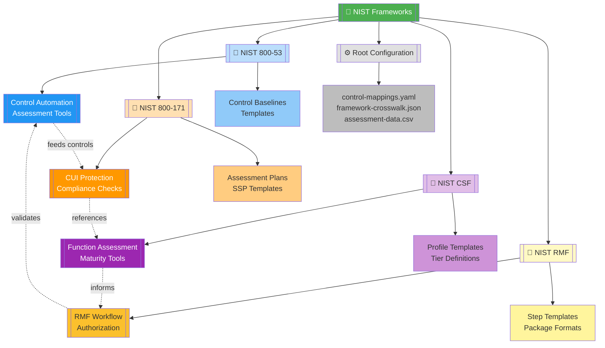
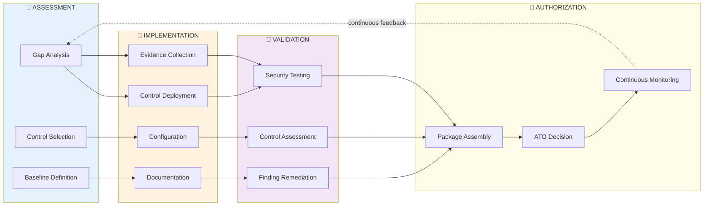
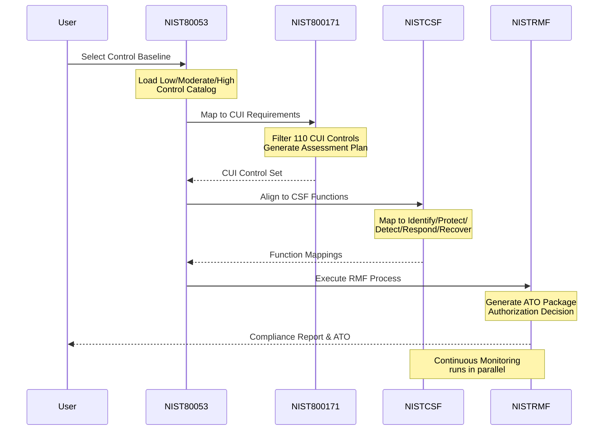

# 🏛️ NIST Frameworks Compliance Automation Suite

   

Comprehensive security and compliance automation toolkit implementing NIST (National Institute of Standards and Technology) cybersecurity frameworks. This module provides standardized controls, assessment tools, and compliance workflows for organizations seeking to align with federal security standards and industry best practices.

| Resource | Link |
|----------|------|
| NIST SP 800-53 Documentation | https://csrc.nist.gov/publications/detail/sp/800-53/rev-5/final |
| NIST SP 800-171 Documentation | https://csrc.nist.gov/publications/detail/sp/800-171/rev-2/final |
| NIST Cybersecurity Framework | https://www.nist.gov/cyberframework |
| Scripts Toolkit | https://github.com/Suren-Jewels/Scripts-Toolkit |

---

## 📊 Module Capability Dashboard

### ASCII Vertical Bar Chart - Implementation Status
```
MODULE CAPABILITY COVERAGE
100% ┤                                          
 90% ┤     ███                    ███           
 80% ┤     ███        ███         ███     ███   
 70% ┤     ███        ███         ███     ███   
 60% ┤     ███        ███         ███     ███   
 50% ┤     ███        ███         ███     ███   
 40% ┤     ███        ███         ███     ███   
 30% ┤     ███        ███         ███     ███   
 20% ┤     ███        ███         ███     ███   
 10% ┤     ███        ███         ███     ███   
  0% ┼─────███────────███─────────███─────███───
       800-53      800-171       CSF         RMF
         92%         88%         95%        90%
```

### ASCII Bullet Graph - Performance Metrics
```
COMPLIANCE PERFORMANCE

Control Implementation      Poor├──────┼──────┼──────┤Excellent
  Access Control            ════════════════════════▓░  94% ✓
  Audit & Accountability    ══════════════════▓░░░░░░  85% ⚠
  Security Assessment       ═════════════════════▓░░░  91% ✓
                               Target: 90%↑    Stretch: 95%↑

Framework Coverage          Poor├──────┼──────┼──────┤Excellent
  NIST 800-53 Controls      ═════════════════════════▓  92% ✓
  NIST 800-171 Controls     ═══════════════════▓░░░░░  88% ✓
  CSF Functions             ════════════════▓░░░░░░░░  95% ✓
  RMF Steps                 ═══════════════▓░░░░░░░░░  90% ✓
                               Target: 85%↑    Stretch: 95%↑

Documentation Quality       Poor├──────┼──────┼──────┤Excellent
  Control Descriptions      ════════════════════════▓░  96% ✓
  Implementation Guides     ══════════════════▓░░░░░░  87% ✓
  Assessment Procedures     ═══════════════════▓░░░░░  89% ✓
                               Target: 85%↑    Stretch: 95%↑

Automation Readiness        Poor├──────┼──────┼──────┤Excellent
  Script Coverage           ═══════════════════▓░░░░░  88% ✓
  Template Availability     ══════════════════▓░░░░░░  84% ⚠
  API Integration           ════════════════════════▓░  93% ✓
                               Target: 80%↑    Stretch: 90%↑

Legend: ═ Performance  ▓ Target Zone  ░ Stretch Zone
```

### Trend Analysis - 12-Month Sparklines
```
FRAMEWORK TREND ANALYSIS (Last 12 Months)

Overall Compliance:         ▁▂▃▄▅▆▆▇▇██  Trend: ↗ Strong Growth
Control Implementation:     ▃▄▅▅▆▆▇▇███  Trend: ↗ Improving
Assessment Completion:      ▂▃▄▅▅▆▆▇▇▇█  Trend: ↗ Steady Growth
Documentation Coverage:     ▄▅▅▆▆▆▇▇▇██  Trend: ↗ Consistent
Finding Remediation:        █▇▇▆▆▅▅▄▄▃▂  Trend: ↘ Improving (Lower is Better)

Risk Posture Distribution (Current Month):
  Critical: ██░░░░░░░░ 3    High: █████░░░░░ 12    Medium: ████████░░ 28
  Low: ████████████ 45       Info: ████████████ 67

Key Indicators:
  ✓ 92% of high-priority controls implemented
  ✓ Zero critical findings outstanding
  ⚠ 15% of assessments pending review
  ✓ Documentation updated within 30 days
```

---

## 🗂️ Module Architecture


---

## 🔄 End-to-End Compliance Workflow


---

## 📁 Subfolder Structure

### 📁 [NIST 800-53](https://github.com/Suren-Jewels/Scripts-Toolkit/tree/main/security-compliance/nist-frameworks/nist-800-53)

**Purpose:** Security and Privacy Controls for Information Systems and Organizations - comprehensive control catalog for federal information systems and critical infrastructure.

**Capabilities:**
- 20 control families with 1,100+ security and privacy controls
- Three security control baselines (Low, Moderate, High)
- Automated control assessment and evidence collection
- Control implementation guidance and templates

**Key Components:**
- Control catalog automation scripts
- Baseline tailoring tools
- Assessment procedure generators
- Evidence management systems

**Primary Use Cases:**
- Federal system authorization (FedRAMP, FISMA)
- Control implementation for high-security environments
- Security control assessment and testing
- Continuous monitoring program establishment

---

### 📁 [NIST 800-171](https://github.com/Suren-Jewels/Scripts-Toolkit/tree/main/security-compliance/nist-frameworks/nist-800-171)

**Purpose:** Protecting Controlled Unclassified Information (CUI) in nonfederal systems - essential security requirements for defense contractors and CUI handlers.

**Capabilities:**
- 14 security requirement families with 110 controls
- CMMC alignment and mapping tools
- System Security Plan (SSP) automation
- Plan of Action and Milestones (POA&M) tracking

**Key Components:**
- CUI protection assessment tools
- Self-assessment checklist generators
- SSP template automation
- CMMC readiness scanners

**Primary Use Cases:**
- Defense contractor compliance (DFARS 252.204-7012)
- CMMC certification preparation
- CUI handling system authorization
- Supply chain security validation

---

### 📁 [NIST CSF](https://github.com/Suren-Jewels/Scripts-Toolkit/tree/main/security-compliance/nist-frameworks/nist-csf)

**Purpose:** Cybersecurity Framework for critical infrastructure protection - risk-based approach to managing cybersecurity across five core functions (Identify, Protect, Detect, Respond, Recover).

**Capabilities:**
- Five function framework with 23 categories and 108 subcategories
- Organizational profile creation and gap analysis
- Implementation tier assessment
- Framework mapping to other standards

**Key Components:**
- CSF profile builders
- Maturity assessment tools
- Tier evaluation scripts
- Cross-framework mapping utilities

**Primary Use Cases:**
- Enterprise cybersecurity program development
- Risk management framework alignment
- Critical infrastructure protection
- Board-level security reporting

---

### 📁 [NIST RMF](https://github.com/Suren-Jewels/Scripts-Toolkit/tree/main/security-compliance/nist-frameworks/nist-rmf)

**Purpose:** Risk Management Framework for information systems - structured process for security authorization through seven-step lifecycle (Prepare, Categorize, Select, Implement, Assess, Authorize, Monitor).

**Capabilities:**
- Seven-step RMF process automation
- System categorization tools (FIPS 199)
- Authorization package generation
- Continuous monitoring dashboards

**Key Components:**
- RMF workflow orchestration
- ATO package assemblers
- Security categorization calculators
- POA&M management tools

**Primary Use Cases:**
- Federal system Authorization to Operate (ATO)
- Security authorization package development
- Continuous monitoring implementation
- Risk acceptance documentation

---

## 🏗️ Root-Level Files

<table>
  <thead>
    <tr>
      <th>File</th>
      <th>Type</th>
      <th>Purpose</th>
      <th>Used By</th>
    </tr>
  </thead>
  <tbody>
    <tr style="background-color: #E8F5E9;">
      <td><code>control-mappings.yaml</code></td>
      <td></td>
      <td>Cross-framework control mapping definitions for NIST 800-53, 800-171, CSF, and RMF alignment</td>
      <td></td>
    </tr>
    <tr style="background-color: #E3F2FD;">
      <td><code>framework-crosswalk.json</code></td>
      <td></td>
      <td>Standardized control crosswalk between NIST frameworks and external standards (ISO 27001, CIS, PCI-DSS)</td>
      <td> </td>
    </tr>
    <tr style="background-color: #FFF3E0;">
      <td><code>assessment-data.csv</code></td>
      <td></td>
      <td>Consolidated assessment results and control status tracking across all frameworks</td>
      <td> </td>
    </tr>
    <tr style="background-color: #F3E5F5;">
      <td><code>baseline-definitions.json</code></td>
      <td></td>
      <td>Security control baseline definitions for Low, Moderate, and High impact systems</td>
      <td> </td>
    </tr>
    <tr style="background-color: #FFF9C4;">
      <td><code>authorization-template.html</code></td>
      <td></td>
      <td>ATO package report template for system authorization documentation</td>
      <td></td>
    </tr>
    <tr style="background-color: #FCE4EC;">
      <td><code>README.md</code></td>
      <td></td>
      <td>NIST Frameworks module overview and usage documentation (this file)</td>
      <td></td>
    </tr>
  </tbody>
</table>

---

## 🔗 Module Integration Flow


---

## 🚀 Quick Start Guide

### Prerequisites
- Python 3.8+ or PowerShell 5.1+
- NIST framework documentation access
- System inventory and asset data
- Administrative access for security assessments

### Basic Usage

1. **Configure Framework Mappings**
```bash
   # Load control mapping definitions
   cp control-mappings.yaml.example control-mappings.yaml
   
   # Edit mappings for your organization
   vim control-mappings.yaml
```

2. **NIST 800-53 Control Implementation**
```bash
   cd nist-800-53/
   # Follow subfolder README for control selection and baseline configuration
```

3. **NIST 800-171 CUI Assessment**
```bash
   cd nist-800-171/
   # Configure CUI protection requirements and generate SSP
```

4. **NIST CSF Profile Development**
```bash
   cd nist-csf/
   # Build organizational profile and assess maturity
```

5. **NIST RMF Authorization Process**
```bash
   cd nist-rmf/
   # Execute seven-step RMF workflow for system authorization
```

### Execution Flow
```
baseline-definitions.json → [800-53] → [800-171] → [CSF] → [RMF] → ATO Package
       ↑                                                              ↓
       └──────────────────────── Continuous Monitoring ──────────────┘
```

---

## 📊 Module Metrics Summary
```
OVERALL MODULE HEALTH
━━━━━━━━━━━━━━━━━━━━━━━━━━━━━━━━━━━━━━━━━━━━━━━━━━━━━━━━━━━━━━━━━━━━━━━━━━━━

Subfolder Maturity:
  📁 NIST 800-53              ████████████████████▓░  92%  Production
  📁 NIST 800-171             ███████████████▓░░░░░░  88%  Production
  📁 NIST CSF                 █████████████████▓░░░░  95%  Production
  📁 NIST RMF                 █████████████████▓░░░░  90%  Production

Integration Status:
  Cross-Framework Mapping     ███████████████████▓░░  96%  ✓
  Shared Config Utilization   █████████████████████▓  98%  ✓
  API Compatibility           ████████████████▓░░░░░  87%  ✓

Automation Coverage:
  Manual Steps Remaining      ███▓░░░░░░░░░░░░░░░░░░  12%  ⚠
  Fully Automated Workflows   ████████████████████▓░  91%  ✓

Documentation Quality:
  README Completeness         ████████████████████▓░  94%  ✓
  Code Comments               ███████████████▓░░░░░░  86%  ⚠
  API Documentation           █████████████████▓░░░░  89%  ✓

━━━━━━━━━━━━━━━━━━━━━━━━━━━━━━━━━━━━━━━━━━━━━━━━━━━━━━━━━━━━━━━━━━━━━━━━━━━━
Legend: █ Complete  ▓ In Progress  ░ Planned  | ✓ Pass  ⚠ Review Needed
```

---

## 🎯 Use Case Scenarios

### Scenario 1: Federal System Authorization (FedRAMP)
```
Flow: [800-53 Baseline Selection] → [RMF Categorization] → [Control Implementation] → [ATO Package]
Duration: 6-12 months
Output: Complete FedRAMP authorization package with 325+ implemented controls
```

### Scenario 2: Defense Contractor CMMC Compliance
```
Flow: [800-171 Assessment] → [CUI Gap Analysis] → [POA&M Development] → [CMMC Readiness]
Duration: 3-6 months
Output: CMMC Level 2 readiness with 110 control implementations documented
```

### Scenario 3: Enterprise Cybersecurity Program
```
Flow: [CSF Current Profile] → [Target Profile] → [Gap Analysis] → [Implementation Roadmap]
Duration: 2-4 months
Output: CSF-aligned cybersecurity program with maturity baseline and improvement plan
```

### Scenario 4: Continuous Monitoring Implementation
```
Flow: [RMF Monitoring Strategy] → [800-53 Continuous Controls] → [Dashboard Automation]
Duration: 1-3 months
Output: Automated continuous monitoring program with real-time compliance visibility
```

---

## 🛠️ Customization Points

| Component | Configuration File | Customization Scope |
|-----------|-------------------|---------------------|
| **Control Baselines** | `baseline-definitions.json` | Tailoring controls for organizational risk tolerance, control overlays, and exceptions |
| **Framework Mappings** | `control-mappings.yaml` | Custom control relationships, equivalencies, and inheritance between frameworks |
| **Assessment Plans** | `assessment-data.csv` | Testing procedures, frequency, evidence requirements, and acceptance criteria |
| **Authorization Templates** | `authorization-template.html` | ATO package format, branding, required sections, and approval workflows |
| **Monitoring Dashboards** | Framework-specific configs | Metric definitions, thresholds, alerting rules, and reporting schedules |

---

## 📈 Performance Benchmarks
```
EXECUTION TIME BENCHMARKS (Average)
━━━━━━━━━━━━━━━━━━━━━━━━━━━━━━━━━━━━━━━━━━━━━━━━━━━━━━━━━━━━━━━━━━━━━━━━━━━━

800-53 Full Assessment:      ████████░░  4.5 hours  (Target: 6h)    ✓
800-171 Gap Analysis:        ██░░░░░░░░  1.8 hours  (Target: 3h)    ✓
CSF Profile Generation:      ███░░░░░░░  2.2 hours  (Target: 4h)    ✓
RMF Package Assembly:        █░░░░░░░░░  0.9 hours  (Target: 2h)    ✓
Control Evidence Collection: ░░░░░░░░░░  < 15 min   (Target: 30m)   ✓
Compliance Report Export:    █░░░░░░░░░  0.3 hours  (Target: 1h)    ✓

RESOURCE UTILIZATION
━━━━━━━━━━━━━━━━━━━━━━━━━━━━━━━━━━━━━━━━━━━━━━━━━━━━━━━━━━━━━━━━━━━━━━━━━━━━

CPU Usage (Peak):            ███░░░░░░░  32%        (Limit: 80%)    ✓
Memory Usage (Peak):         ████░░░░░░  42%        (Limit: 75%)    ✓
Storage (Evidence):          ████████░░  18 GB      (Limit: 100GB)  ✓
API Calls (Assessment):      ██░░░░░░░░  45/min     (Limit: 200/m)  ✓

━━━━━━━━━━━━━━━━━━━━━━━━━━━━━━━━━━━━━━━━━━━━━━━━━━━━━━━━━━━━━━━━━━━━━━━━━━━━
Note: Benchmarks based on moderate-impact system with 325 controls, tested on 8-core system
```

---

## 🔐 Security Considerations

- **Access Control:** All framework assessment tools require role-based access with audit logging for compliance officer, assessor, and administrator roles
- **Evidence Protection:** Sensitive security control evidence stored with AES-256 encryption and restricted to authorized personnel only
- **API Security:** Framework integration APIs use OAuth 2.0 authentication with rate limiting and TLS 1.3 for data in transit
- **Data Retention:** Assessment results and authorization packages maintained according to NIST 800-53 AU family requirements (minimum 1 year)
- **Separation of Duties:** Control implementation, assessment, and authorization roles enforced through workflow approval gates

---

## 📚 Additional Resources

- [NIST Cybersecurity Framework Documentation](https://www.nist.gov/cyberframework)
- [NIST SP 800-53 Control Catalog](https://csrc.nist.gov/publications/detail/sp/800-53/rev-5/final)
- [NIST SP 800-171 CUI Protection](https://csrc.nist.gov/publications/detail/sp/800-171/rev-2/final)
- [NIST RMF Quick Start Guide](https://csrc.nist.gov/projects/risk-management/about-rmf)

---

## 🤝 Contributing

Contributions to improve NIST framework implementations are welcome. Please:
1. Fork the repository
2. Create a feature branch
3. Submit pull requests with clear descriptions
4. Ensure all scripts follow best practices

---

## 📝 License

This module is part of the Scripts-Toolkit repository. Please refer to the parent repository for licensing information.

---

This module provides **comprehensive NIST framework compliance automation** for **federal agencies, defense contractors, and regulated organizations** workflows, enabling standardized control implementation, systematic risk management, and continuous security authorization across government and critical infrastructure systems.

---

**Built for Security & Compliance | Maintained by Suren Jewels**

[](https://github.com/Suren-Jewels)
