# 🏛️ NIST Frameworks Compliance Automation Suite

   

Comprehensive automation toolkit for NIST cybersecurity frameworks including NIST 800-53, NIST 800-171, NIST Cybersecurity Framework (CSF), and Risk Management Framework (RMF). This suite provides validation, assessment, reporting, and continuous monitoring capabilities across federal compliance requirements.

| Resource | Link |
|----------|------|
| NIST 800-53 Controls | https://csrc.nist.gov/publications/detail/sp/800-53/rev-5/final |
| NIST 800-171 Standard | https://csrc.nist.gov/publications/detail/sp/800-171/rev-2/final |
| NIST CSF Framework | https://www.nist.gov/cyberframework |
| NIST RMF Process | https://csrc.nist.gov/projects/risk-management |
| Repository | https://github.com/Suren-Jewels/Scripts-Toolkit |

---

## 📊 Current Compliance Status
```
NIST 800-53 (Rev 5)                 [███████████████████░░░░░] 78% (312/400) ✓
NIST 800-171 (Rev 2)                [█████████████████████░░░] 85% (119/140) ✓
────────────────────────────────────────────────────────────────────────────
NIST CSF Core Functions:
  Identify                          [████████████████████████] 92% (23/25)   ✓
  Protect                           [████████████████████░░░░] 81% (85/105)  ⚠
  Detect                            [██████████████████████░░] 88% (44/50)   ✓
  Respond                           [███████████████████░░░░░] 76% (38/50)   ⚠
  Recover                           [████████████████████░░░░] 80% (20/25)   ✓
────────────────────────────────────────────────────────────────────────────
RMF Process Completion              [██████████████████░░░░░░] 73% (146/200) ⚠
────────────────────────────────────────────────────────────────────────────
RMF Step Compliance:
  Prepare (Step 1)                  [████████████████████████] 95% (38/40)   ✓
  Categorize (Step 2)               [████████████████████████] 90% (36/40)   ✓
  Select (Step 3)                   [███████████████████░░░░░] 75% (30/40)   ⚠
  Implement (Step 4)                [██████████████████░░░░░░] 65% (26/40)   ⚠
  Assess (Step 5)                   [███████████████░░░░░░░░░] 60% (24/40)   ❌
  Authorize (Step 6)                [████████████████████████] 88% (35/40)   ✓
  Monitor (Step 7)                  [███████████████████████░] 85% (34/40)   ✓
────────────────────────────────────────────────────────────────────────────
Monthly Trend:  ▃▄▅▆▆▇█  (Improving)

Control Risk Distribution:
  Low: 245  |  Moderate: 187  |  High: 94  |  Critical: 23  |  Not Assessed: 51
```

---

## 🗂️ Module Architecture
```mermaid
graph TD
    Root[[🏛️ NIST Frameworks Suite]]
    
    Root --> NIST80053[[📋 NIST 800-53]]
    Root --> NIST800171[[🔒 NIST 800-171]]
    Root --> NISTCSF[[🛡️ NIST CSF]]
    Root --> NISTRM F[[⚙️ NIST RMF]]
    
    NIST80053 --> F1[800-53-controls-validator.py]
    NIST80053 --> F2[800-53-gap-analyzer.py]
    NIST80053 --> F3[800-53-report-generator.py]
    NIST80053 --> F4[800-53-baseline-checker.sh]
    
    NIST800171 --> F5[800-171-cui-validator.py]
    NIST800171 --> F6[800-171-compliance-scanner.py]
    NIST800171 --> F7[800-171-assessment-tool.py]
    NIST800171 --> F8[800-171-audit-logger.sh]
    
    NISTCSF --> F9[csf-maturity-assessor.py]
    NISTCSF --> F10[csf-function-mapper.py]
    NISTCSF --> F11[csf-profile-builder.py]
    NISTCSF --> F12[csf-dashboard-generator.py]
    
    NISTRMF --> F13[rmf-step-orchestrator.py]
    NISTRMF --> F14[rmf-poam-manager.py]
    NISTRMF --> F15[rmf-ato-validator.py]
    NISTRMF --> F16[rmf-continuous-monitor.py]
    
    NIST80053 --> C1[800-53-baselines.json]
    NIST800171 --> C2[800-171-requirements.json]
    NISTCSF --> C3[csf-framework-mapping.json]
    NISTRMF --> C4[rmf-workflow-config.yaml]
    
    F1 -.references.-> C1
    F2 -.references.-> C1
    F5 -.references.-> C2
    F6 -.references.-> C2
    F9 -.references.-> C3
    F10 -.references.-> C3
    F13 -.references.-> C4
    F14 -.references.-> C4
    
    style NIST80053 fill:#BBDEFB
    style NIST800171 fill:#FFE0B2
    style NISTCSF fill:#E1BEE7
    style NISTRMF fill:#C8E6C9
    
    style F1 fill:#2196F3,color:#fff
    style F2 fill:#2196F3,color:#fff
    style F3 fill:#2196F3,color:#fff
    style F4 fill:#2196F3,color:#fff
    style F5 fill:#FF9800,color:#fff
    style F6 fill:#FF9800,color:#fff
    style F7 fill:#FF9800,color:#fff
    style F8 fill:#FF9800,color:#fff
    style F9 fill:#9C27B0,color:#fff
    style F10 fill:#9C27B0,color:#fff
    style F11 fill:#9C27B0,color:#fff
    style F12 fill:#9C27B0,color:#fff
    style F13 fill:#4CAF50,color:#fff
    style F14 fill:#4CAF50,color:#fff
    style F15 fill:#4CAF50,color:#fff
    style F16 fill:#4CAF50,color:#fff
    
    style C1 fill:#FFF9C4
    style C2 fill:#FFF9C4
    style C3 fill:#FFF9C4
    style C4 fill:#FFF9C4
```

---

## 🔄 Compliance Assessment Workflow

```mermaid
flowchart LR
    subgraph INPUTS["📥 INPUTS"]
        I1[System Security<br/>Configuration Files]
        I2[Compliance<br/>Requirements Matrix]
        I3[Control Evidence<br/>Documentation]
        I4[Continuous<br/>Monitoring Data]
    end
    
    subgraph PROCESSING["⚙️ PROCESSING"]
        P1[Control Validation<br/>Engine]
        P2[Gap Analysis<br/>Processor]
        P3[Risk Assessment<br/>Calculator]
        P4[Compliance<br/>Scoring Engine]
    end
    
    subgraph OUTPUTS["📤 OUTPUTS"]
        O1[Compliance Reports<br/>PDF/HTML/JSON]
        O2[Gap Analysis<br/>Dashboard]
        O3[POA&M Artifacts<br/>Excel/CSV]
        O4[ATO Package<br/>Documentation]
    end
    
    I1 --> P1
    I2 --> P2
    I3 --> P3
    I4 --> P4
    
    P1 --> O1
    P2 --> O2
    P3 --> O3
    P4 --> O4
    
    style INPUTS fill:#E3F2FD
    style PROCESSING fill:#FFF3E0
    style OUTPUTS fill:#E8F5E9
```


---

## ⚙️ Control Validation Logic Flow

```mermaid
flowchart TD
    Start([Start Validation Process]) --> Step1[Load Framework Configuration]
    Step1 --> Step2[Initialize Control Catalog]
    
    Step2 --> Loop{For Each Control}
    
    Loop -->|Next Control| Decision1{Evidence Available?}
    
    Decision1 -->|No| Action1[❌ Mark as Not Implemented]
    Decision1 -->|Yes| Decision2{Meets Requirements?}
    
    Decision2 -->|No| Action2[⚠️ Mark as Partially Compliant]
    Decision2 -->|Yes| Decision3{Automated Validation?}
    
    Decision3 -->|Yes| Action3[✓ Execute Automated Check]
    Decision3 -->|No| Action4[✓ Manual Review Required]
    
    Action3 --> Verify{Check Passed?}
    
    Verify -->|Yes| Action5[✓ Mark as Compliant]
    Verify -->|No| Action2
    
    Action1 --> Collect[Collect Assessment Results]
    Action2 --> Collect
    Action4 --> Collect
    Action5 --> Collect
    
    Collect --> MoreControls{More Controls?}
    
    MoreControls -->|Yes| Loop
    MoreControls -->|No| Generate[Generate Compliance Report]
    
    Generate --> Calculate[Calculate Risk Scores & Metrics]
    Calculate --> CreatePOAM[Generate POA&M for Gaps]
    CreatePOAM --> Output([📄 Output Assessment Package])
    
    style Start fill:#4CAF50,color:#fff
    style Output fill:#4CAF50,color:#fff
    style Action5 fill:#4CAF50,color:#fff
    style Action2 fill:#FF9800,color:#fff
    style Action1 fill:#F44336,color:#fff
    style Action3 fill:#4CAF50,color:#fff
    style Action4 fill:#2196F3,color:#fff
    style Decision1 fill:#2196F3,color:#fff
    style Decision2 fill:#2196F3,color:#fff
    style Decision3 fill:#2196F3,color:#fff
    style MoreControls fill:#2196F3,color:#fff
    style Verify fill:#2196F3,color:#fff
```


---

## 🔗 System Integration

```mermaid
sequenceDiagram
    participant Auditor
    participant ValidationScript
    participant FrameworkAPI
    participant EvidenceDB
    participant ReportEngine
    
    Auditor->>ValidationScript: Initiate Assessment
    Note over ValidationScript: Load Framework Controls
    ValidationScript->>FrameworkAPI: Fetch Control Requirements
    FrameworkAPI->>EvidenceDB: Query Control Evidence
    EvidenceDB-->>FrameworkAPI: Return Evidence Documents
    FrameworkAPI-->>ValidationScript: Control Data Package
    
    Note over ValidationScript: Execute Validation Checks
    
    ValidationScript->>ValidationScript: Automated Technical Tests
    
    loop For Each Control Family
        ValidationScript->>FrameworkAPI: Submit Assessment Results
        FrameworkAPI->>EvidenceDB: Store Compliance Data
        EvidenceDB-->>FrameworkAPI: Confirmation
        FrameworkAPI-->>ValidationScript: Status Update
    end
    
    ValidationScript->>ReportEngine: Generate Compliance Report
    ReportEngine->>EvidenceDB: Fetch Assessment History
    EvidenceDB-->>ReportEngine: Historical Data
    ReportEngine->>ReportEngine: Calculate Trends & Metrics
    ReportEngine-->>ValidationScript: Report Package
    
    ValidationScript-->>Auditor: 📊 Complete Assessment Results
```


---

## 📂 File Reference Table

<table>
  <thead>
    <tr>
      <th>File</th>
      <th>Type</th>
      <th>Purpose</th>
      <th>Framework</th>
    </tr>
  </thead>
  <tbody>
    <tr style="background-color: #E3F2FD;">
      <td><code>800-53-controls-validator.py</code></td>
      <td></td>
      <td>Validates NIST 800-53 Rev 5 control implementations against security baselines</td>
      <td></td>
    </tr>
    <tr style="background-color: #F3E5F5;">
      <td><code>800-53-gap-analyzer.py</code></td>
      <td></td>
      <td>Performs gap analysis between current state and required control baselines</td>
      <td></td>
    </tr>
    <tr style="background-color: #E3F2FD;">
      <td><code>800-53-report-generator.py</code></td>
      <td></td>
      <td>Generates comprehensive compliance reports in multiple formats (PDF/HTML/JSON)</td>
      <td></td>
    </tr>
    <tr style="background-color: #F3E5F5;">
      <td><code>800-53-baseline-checker.sh</code></td>
      <td></td>
      <td>Automated baseline compliance checker for Low/Moderate/High impact systems</td>
      <td></td>
    </tr>
    <tr style="background-color: #FFF3E0;">
      <td><code>800-171-cui-validator.py</code></td>
      <td></td>
      <td>Validates Controlled Unclassified Information (CUI) protection requirements</td>
      <td></td>
    </tr>
    <tr style="background-color: #FCE4EC;">
      <td><code>800-171-compliance-scanner.py</code></td>
      <td></td>
      <td>Scans system configurations for NIST 800-171 compliance across 14 families</td>
      <td></td>
    </tr>
    <tr style="background-color: #FFF3E0;">
      <td><code>800-171-assessment-tool.py</code></td>
      <td></td>
      <td>Comprehensive assessment tool for DoD contractors and CUI handlers</td>
      <td></td>
    </tr>
    <tr style="background-color: #FCE4EC;">
      <td><code>800-171-audit-logger.sh</code></td>
      <td></td>
      <td>Captures audit events and generates compliance-ready audit trails</td>
      <td></td>
    </tr>
    <tr style="background-color: #E8F5E9;">
      <td><code>csf-maturity-assessor.py</code></td>
      <td></td>
      <td>Assesses cybersecurity maturity across CSF Core Functions using tier model</td>
      <td></td>
    </tr>
    <tr style="background-color: #E0F7FA;">
      <td><code>csf-function-mapper.py</code></td>
      <td></td>
      <td>Maps organizational controls to CSF Categories and Subcategories</td>
      <td></td>
    </tr>
    <tr style="background-color: #E8F5E9;">
      <td><code>csf-profile-builder.py</code></td>
      <td></td>
      <td>Creates custom CSF Profiles tailored to organizational risk appetite</td>
      <td></td>
    </tr>
    <tr style="background-color: #E0F7FA;">
      <td><code>csf-dashboard-generator.py</code></td>
      <td></td>
      <td>Generates executive dashboards with CSF maturity metrics and visualizations</td>
      <td></td>
    </tr>
    <tr style="background-color: #EEEEEE;">
      <td><code>rmf-step-orchestrator.py</code></td>
      <td></td>
      <td>Orchestrates RMF 7-step process workflow from Prepare through Monitor</td>
      <td></td>
    </tr>
    <tr style="background-color: #FFF9C4;">
      <td><code>rmf-poam-manager.py</code></td>
      <td></td>
      <td>Manages Plan of Action and Milestones (POA&M) tracking and remediation</td>
      <td></td>
    </tr>
    <tr style="background-color: #EEEEEE;">
      <td><code>rmf-ato-validator.py</code></td>
      <td></td>
      <td>Validates completeness of Authorization to Operate (ATO) documentation packages</td>
      <td></td>
    </tr>
    <tr style="background-color: #FFF9C4;">
      <td><code>rmf-continuous-monitor.py</code></td>
      <td></td>
      <td>Continuous monitoring engine for ongoing authorization maintenance</td>
      <td></td>
    </tr>
    <tr style="background-color: #FFF9C4;">
      <td><code>800-53-baselines.json</code></td>
      <td></td>
      <td>Control baseline definitions for Low/Moderate/High impact systems</td>
      <td></td>
    </tr>
    <tr style="background-color: #FFF9C4;">
      <td><code>800-171-requirements.json</code></td>
      <td></td>
      <td>Structured requirements mapping for all 110 security requirements</td>
      <td></td>
    </tr>
    <tr style="background-color: #FFF9C4;">
      <td><code>csf-framework-mapping.json</code></td>
      <td></td>
      <td>Cross-framework mappings between CSF and other standards (800-53, ISO 27001)</td>
      <td></td>
    </tr>
    <tr style="background-color: #FFF9C4;">
      <td><code>rmf-workflow-config.yaml</code></td>
      <td></td>
      <td>RMF workflow definitions, task sequences, and approval gates</td>
      <td></td>
    </tr>
  </tbody>
</table>

---

This module provides **automated compliance validation and assessment** for **NIST cybersecurity frameworks** workflows, enabling streamlined control implementation tracking, continuous compliance monitoring, and accelerated authorization processes across federal, DoD, and commercial environments requiring rigorous security standards.

---

**Built for Federal Cybersecurity Compliance | Maintained by Suren Jewels**

[](https://github.com/Suren-Jewels)
