# 🔐 NIST 800-171 Compliance Automation Module

   

A comprehensive automation toolkit for validating NIST 800-171 compliance requirements, protecting Controlled Unclassified Information (CUI), and generating detailed security assessment reports across all 14 control families and 110 security requirements.

| Resource | Link |
|----------|------|
| NIST 800-171 Rev 2 | https://csrc.nist.gov/publications/detail/sp/800-171/rev-2/final |
| CUI Protection Guidance | https://www.archives.gov/cui |
| CMMC Assessment Guide | https://www.acq.osd.mil/cmmc/ |
| GitHub Repository | https://github.com/Suren-Jewels/Scripts-Toolkit |

---

## 📊 Current NIST 800-171 Compliance Status
```
Overall Control Implementation      [████████████████████░░░░] 83% (91/110) ✓
CUI Protection Controls             [███████████████████░░░░░] 78% (28/36)  ⚠
Assessment Report Coverage          [████████████████████████] 100% (14/14) ✓
────────────────────────────────────────────────────────────────────────────
Access Control (AC):
  Authentication Mechanisms         [████████████████████████] 100% (22/22) ✓
  Least Privilege Implementation    [███████████████████████░] 95% (19/20)  ✓
  Remote Access Controls            [██████████████████████░░] 90% (9/10)   ✓
────────────────────────────────────────────────────────────────────────────
System & Communications (SC)        [███████████████████░░░░░] 76% (13/17)  ⚠
────────────────────────────────────────────────────────────────────────────
Incident Response (IR):
  Detection Capabilities            [████████████████████████] 100% (5/5)   ✓
  Response Procedures               [███████████████████████░] 92% (11/12)  ✓
────────────────────────────────────────────────────────────────────────────
Monthly Trend:  ▃▅▆▆▇▇█  (Improving)

Risk Distribution:
  Critical: 2  |  High: 7  |  Medium: 10  |  Low: 15  |  Compliant: 76
```

---

## 🗂️ Module Architecture

```mermaid
graph TD
    Root[[🔐 NIST 800-171 Module]]
    
    Root --> Category1[[🔍 Compliance Validation]]
    Root --> Category2[[🛡️ CUI Protection]]
    Root --> Category3[[📊 Assessment Reporting]]
    Root --> Category4[[⚙️ Configuration]]
    
    Category1 --> File1[nist-800-171-compliance-check.py]
    Category1 --> File2[control-self-assessment.yaml]
    
    Category2 --> File3[cui-protection-validator.sh]
    
    Category3 --> File4[security-assessment-report.py]
    
    Category4 --> Config1[nist-800-171-control-map.json]
    
    File1 -.references.-> Config1
    File3 -.references.-> Config1
    File4 -.references.-> Config1
    File2 -.references.-> Config1
    
    style Category1 fill:#BBDEFB
    style Category2 fill:#C8E6C9
    style Category3 fill:#E1BEE7
    style Category4 fill:#FFF9C4
    
    style File1 fill:#2196F3,color:#fff
    style File2 fill:#2196F3,color:#fff
    style File3 fill:#4CAF50,color:#fff
    style File4 fill:#9C27B0,color:#fff
    
    style Config1 fill:#FBC02D
```


---

## 🔄 NIST 800-171 Assessment Workflow

```mermaid
flowchart LR
    subgraph INPUTS["📥 INPUTS"]
        I1[System Configuration<br/>Infrastructure Data]
        I2[Security Policies<br/>Documentation]
        I3[Access Control Lists<br/>User Permissions]
        I4[Audit Logs<br/>Security Events]
    end
    
    subgraph PROCESSING["⚙️ PROCESSING"]
        P1[Control Validation<br/>Python Engine]
        P2[Policy Analysis<br/>YAML Parser]
        P3[CUI Protection Check<br/>Bash Validator]
        P4[Assessment Aggregation<br/>Reporting Engine]
    end
    
    subgraph OUTPUTS["📤 OUTPUTS"]
        O1[Compliance Matrix<br/>JSON Format]
        O2[Gap Analysis<br/>PDF Report]
        O3[CUI Status<br/>HTML Dashboard]
        O4[POA&M Document<br/>Excel/CSV]
    end
    
    I1 --> P1
    I2 --> P2
    I3 --> P3
    I4 --> P4
    
    P1 --> O1
    P2 --> O2
    P3 --> O3
    P4 --> O4
    
    style INPUTS fill:#E3F2FD
    style PROCESSING fill:#FFF3E0
    style OUTPUTS fill:#E8F5E9
```


---

## ⚙️ Compliance Validation Logic Flow

```mermaid
flowchart TD
    Start([Start Assessment]) --> Step1[Load NIST 800-171 Control Map]
    Step1 --> Step2[Initialize System Inventory]
    
    Step2 --> Loop{For Each Control Family}
    
    Loop -->|Next Family| Decision1{Control Implemented?}
    
    Decision1 -->|No| Action1[❌ Record Non-Compliance]
    Decision1 -->|Partial| Decision2{Evidence Sufficient?}
    Decision1 -->|Yes| Action3[✓ Mark Compliant]
    
    Decision2 -->|No| Action2[⚠️ Flag for Manual Review]
    Decision2 -->|Yes| Action3
    
    Action1 --> Collect[Aggregate Findings]
    Action2 --> Collect
    Action3 --> Collect
    
    Collect --> MoreFamilies{More Control Families?}
    
    MoreFamilies -->|Yes| Loop
    MoreFamilies -->|No| Generate[Generate Assessment Report]
    
    Generate --> Calculate[Calculate Compliance Score]
    Calculate --> Risk[Perform Risk Analysis]
    Risk --> Output([📄 Output Results])
    
    style Start fill:#4CAF50,color:#fff
    style Output fill:#4CAF50,color:#fff
    style Action3 fill:#4CAF50,color:#fff
    style Action2 fill:#FF9800,color:#fff
    style Action1 fill:#F44336,color:#fff
    style Decision1 fill:#2196F3,color:#fff
    style Decision2 fill:#2196F3,color:#fff
    style MoreFamilies fill:#2196F3,color:#fff
```


---

## 🔗 System Integration


---

## 📂 File Reference Table

<table>
  <thead>
    <tr>
      <th>File</th>
      <th>Type</th>
      <th>Purpose</th>
      <th>Control Category</th>
    </tr>
  </thead>
  <tbody>
    <tr style="background-color: #E3F2FD;">
      <td><code>nist-800-171-compliance-check.py</code></td>
      <td></td>
      <td>Validates all 110 NIST 800-171 security requirements across 14 control families, performs automated compliance checks, and identifies gaps</td>
      <td></td>
    </tr>
    <tr style="background-color: #E8F5E9;">
      <td><code>cui-protection-validator.sh</code></td>
      <td></td>
      <td>Validates CUI protection controls including access restrictions, encryption requirements, and data handling procedures</td>
      <td></td>
    </tr>
    <tr style="background-color: #F3E5F5;">
      <td><code>security-assessment-report.py</code></td>
      <td></td>
      <td>Generates comprehensive NIST 800-171 assessment reports with compliance matrices, gap analysis, and POA&M recommendations</td>
      <td></td>
    </tr>
    <tr style="background-color: #FFF9C4;">
      <td><code>control-self-assessment.yaml</code></td>
      <td></td>
      <td>Self-assessment template for documenting control implementation status, evidence collection, and compliance tracking</td>
      <td></td>
    </tr>
    <tr style="background-color: #FFF3E0;">
      <td><code>nist-800-171-control-map.json</code></td>
      <td></td>
      <td>Complete mapping of all 110 NIST 800-171 controls organized by 14 families (AC, AT, AU, CA, CM, IA, IR, MA, MP, PE, PS, RA, SA, SC)</td>
      <td></td>
    </tr>
  </tbody>
</table>

---

## 📋 Summary

This module provides **automated compliance validation** for **NIST 800-171** workflows, enabling comprehensive control assessment, CUI protection verification, and detailed security reporting across all 14 control families and 110 security requirements for contractors handling federal contract information.

---

**Built for Federal Contract Information Security | Maintained by Suren Jewels**

[](https://github.com/Suren-Jewels)
