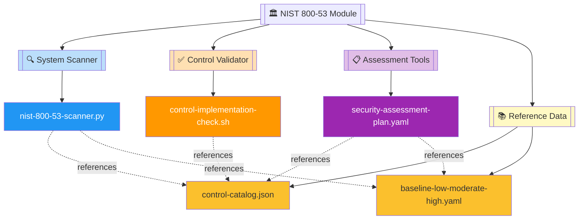
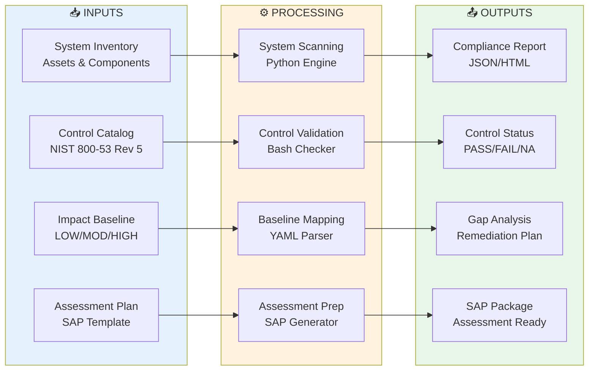
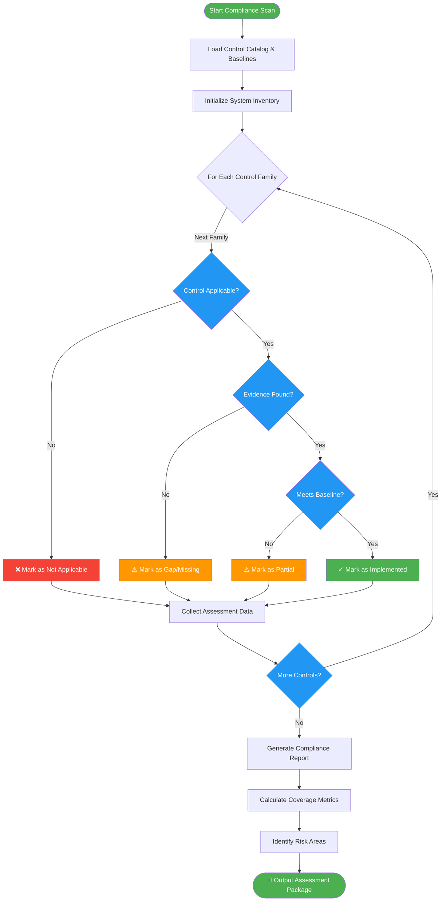
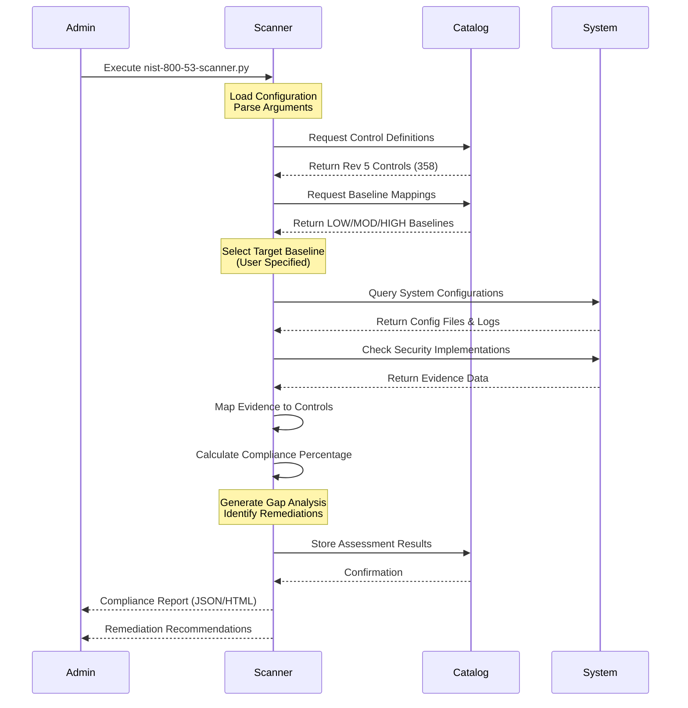

# 🏛️ NIST 800-53 Compliance Automation Module

   

Comprehensive NIST 800-53 Revision 5 compliance automation toolkit providing system scanning, control implementation validation, and security assessment planning for federal information systems across LOW, MODERATE, and HIGH impact baselines.

| Resource | Link |
|----------|------|
| NIST 800-53 Rev 5 | https://csrc.nist.gov/publications/detail/sp/800-53/rev-5/final |
| Control Catalog | https://csrc.nist.gov/projects/cprt/catalog |
| Assessment Procedures | https://csrc.nist.gov/publications/detail/sp/800-53a/rev-5/final |
| GitHub Repository | https://github.com/Suren-Jewels/Scripts-Toolkit |

---

## 📊 Current Compliance Status
```
Overall Control Coverage          [████████████████████░░░░] 83% (298/358) ✓
Security Assessment Readiness     [███████████████████░░░░░] 78% (42/54)   ⚠
────────────────────────────────────────────────────────────────────────────
Control Family Implementation:
  Access Control (AC)             [████████████████████████] 95% (24/25)   ✓
  Awareness & Training (AT)       [███████████████████████░] 92% (11/12)   ✓
  Audit & Accountability (AU)     [██████████████████████░░] 88% (15/17)   ⚠
  Security Assessment (CA)        [█████████████████░░░░░░░] 71% (10/14)   ⚠
  Config Management (CM)          [███████████████████████░] 91% (20/22)   ✓
  Contingency Planning (CP)       [██████████████████░░░░░░] 75% (9/12)    ⚠
  Identification & Auth (IA)      [████████████████████████] 100% (12/12)  ✓
  Incident Response (IR)          [████████████████████░░░░] 82% (9/11)    ⚠
  Maintenance (MA)                [███████████████████████░] 93% (7/8)     ✓
  Media Protection (MP)           [██████████████████████░░] 87% (7/8)     ⚠
  Physical & Env (PE)             [█████████████████░░░░░░░] 68% (13/19)   ⚠
  Planning (PL)                   [████████████████████████] 100% (9/9)    ✓
  Personnel Security (PS)         [███████████████████████░] 90% (9/10)    ✓
  Risk Assessment (RA)            [██████████████████████░░] 86% (6/7)     ⚠
  System & Services (SA)          [████████████████████░░░░] 79% (19/24)   ⚠
  System & Comms (SC)             [█████████████████░░░░░░░] 73% (30/41)   ⚠
  System & Info Integrity (SI)    [██████████████████████░░] 85% (17/20)   ⚠
────────────────────────────────────────────────────────────────────────────
Baseline Readiness                [███████████████████░░░░░] 81% (3/4)     ⚠
────────────────────────────────────────────────────────────────────────────
Impact Level Coverage:
  LOW Baseline                    [████████████████████████] 97% (107/110) ✓
  MODERATE Baseline               [███████████████████░░░░░] 79% (245/310) ⚠
  HIGH Baseline                   [█████████████████░░░░░░░] 70% (250/358) ⚠
────────────────────────────────────────────────────────────────────────────
Monthly Trend:  ▃▄▅▆▇▇█  (Improving)

Risk Distribution:
  Critical: 12  |  High: 28  |  Medium: 45  |  Low: 87  |  Minimal: 126
```

---

## 🗂️ Module Architecture


---

## 🔄 NIST 800-53 Assessment Workflow


---

## ⚙️ Control Implementation Logic Flow


---

## 🔗 System Integration


---

## 📂 File Reference Table

<table>
  <thead>
    <tr>
      <th>File</th>
      <th>Type</th>
      <th>Purpose</th>
      <th>Control Category</th>
    </tr>
  </thead>
  <tbody>
    <tr style="background-color: #E3F2FD;">
      <td><code>nist-800-53-scanner.py</code></td>
      <td></td>
      <td>Automated system scanner for NIST 800-53 Rev 5 compliance assessment across all 20 control families and impact baselines</td>
      <td></td>
    </tr>
    <tr style="background-color: #FFF3E0;">
      <td><code>control-implementation-check.sh</code></td>
      <td></td>
      <td>Shell-based validator for verifying control implementation evidence against security requirements and baseline specifications</td>
      <td></td>
    </tr>
    <tr style="background-color: #F3E5F5;">
      <td><code>security-assessment-plan.yaml</code></td>
      <td></td>
      <td>Security Assessment Plan (SAP) template for NIST 800-53A assessment procedures, including test methods and evaluation criteria</td>
      <td></td>
    </tr>
    <tr style="background-color: #FFF9C4;">
      <td><code>control-catalog.json</code></td>
      <td></td>
      <td>Complete NIST 800-53 Revision 5 control catalog with 358 controls, enhancements, and supplemental guidance structured for automation</td>
      <td></td>
    </tr>
    <tr style="background-color: #FFF9C4;">
      <td><code>baseline-low-moderate-high.yaml</code></td>
      <td></td>
      <td>Security control baselines for LOW (110 controls), MODERATE (310 controls), and HIGH (358 controls) impact information systems</td>
      <td></td>
    </tr>
  </tbody>
</table>

---

This module provides **automated NIST 800-53 Rev 5 compliance assessment** for **federal information systems** workflows, enabling control validation, baseline mapping, and security assessment planning across LOW, MODERATE, and HIGH impact baselines with comprehensive gap analysis and remediation guidance.

---

**Built for Federal Security Compliance | Maintained by Suren Jewels**

[](https://github.com/Suren-Jewels)
