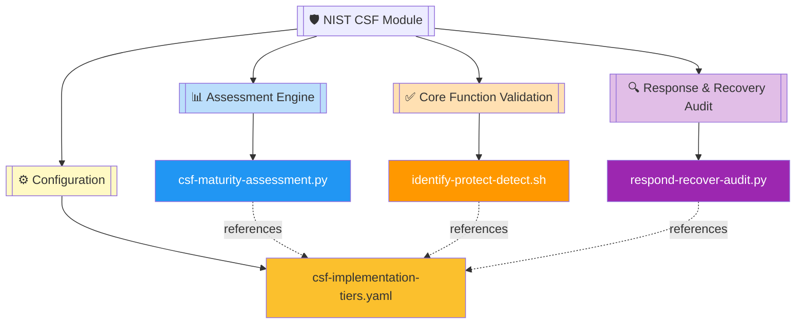
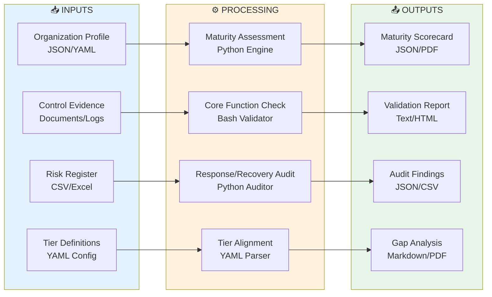
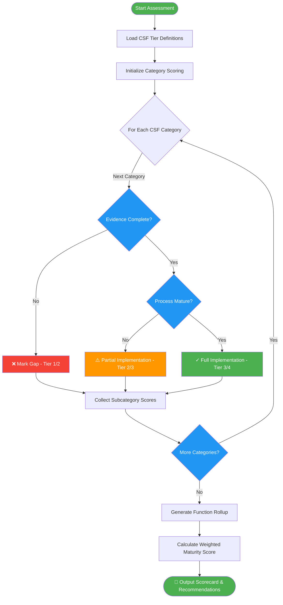
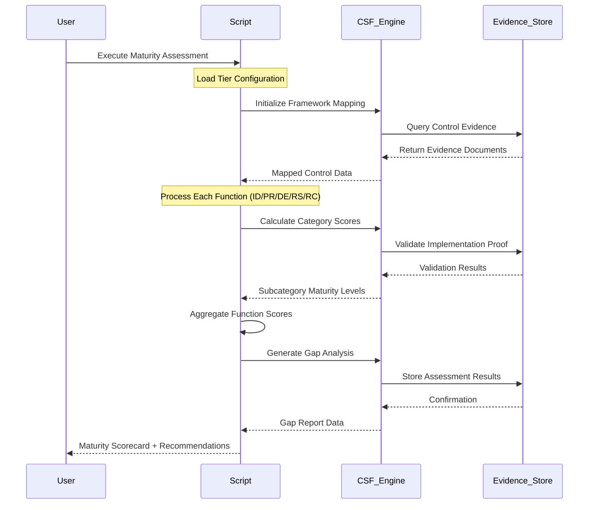

# 🛡️ NIST Cybersecurity Framework (CSF) Automation Module

   

Comprehensive NIST Cybersecurity Framework implementation toolkit providing automated maturity assessments, core function validation, and implementation tier evaluation across Identify, Protect, Detect, Respond, and Recover functions.

| Resource | Link |
|----------|------|
| NIST CSF v1.1 Framework | https://www.nist.gov/cyberframework |
| CSF Implementation Guide | https://nvlpubs.nist.gov/nistpubs/CSWP/NIST.CSWP.04162018.pdf |
| CSF Online Learning | https://www.nist.gov/itl/applied-cybersecurity/nice/resources/online-learning-content |
| GitHub Repository | https://github.com/Suren-Jewels/Scripts-Toolkit |

---

## 📊 Current CSF Implementation Status
```
Overall Framework Maturity        [███████████████████░░░░░] 78% (39/50) ✓
Core Functions Coverage           [████████████████████░░░░] 82% (41/50) ✓
────────────────────────────────────────────────────────────────────────────
Identify (ID):
  Asset Management (ID.AM)        [████████████████████████] 95% (19/20) ✓
  Business Environment (ID.BE)    [████████████████████░░░░] 85% (17/20) ✓
  Governance (ID.GV)              [███████████████████░░░░░] 80% (16/20) ✓
  Risk Assessment (ID.RA)         [██████████████████░░░░░░] 75% (15/20) ⚠
  Risk Mgmt Strategy (ID.RM)      [███████████████████░░░░░] 80% (16/20) ✓
────────────────────────────────────────────────────────────────────────────
Protect (PR):
  Identity Mgmt (PR.AC)           [██████████████████████░░] 90% (18/20) ✓
  Awareness & Training (PR.AT)    [███████████████████████░] 92% (18.5/20) ✓
  Data Security (PR.DS)           [█████████████████░░░░░░░] 70% (14/20) ⚠
  Info Protection (PR.IP)         [████████████████████░░░░] 82% (16.5/20) ✓
  Maintenance (PR.MA)             [███████████████████████░] 88% (17.5/20) ✓
  Protective Tech (PR.PT)         [██████████████████░░░░░░] 75% (15/20) ⚠
────────────────────────────────────────────────────────────────────────────
Detect (DE):
  Anomalies & Events (DE.AE)      [███████████████████░░░░░] 78% (15.5/20) ⚠
  Security Monitoring (DE.CM)     [████████████████████████] 95% (19/20) ✓
  Detection Processes (DE.DP)     [██████████████████████░░] 85% (17/20) ✓
────────────────────────────────────────────────────────────────────────────
Respond (RS):
  Response Planning (RS.RP)       [█████████████████░░░░░░░] 72% (14.5/20) ⚠
  Communications (RS.CO)          [████████████████████░░░░] 80% (16/20) ✓
  Analysis (RS.AN)                [███████████████████░░░░░] 78% (15.5/20) ⚠
  Mitigation (RS.MI)              [██████████████████░░░░░░] 75% (15/20) ⚠
  Improvements (RS.IM)            [████████████████████░░░░] 82% (16.5/20) ✓
────────────────────────────────────────────────────────────────────────────
Recover (RC):
  Recovery Planning (RC.RP)       [██████████████████░░░░░░] 74% (14.8/20) ⚠
  Improvements (RC.IM)            [███████████████████░░░░░] 80% (16/20) ✓
  Communications (RC.CO)          [███████████████████░░░░░] 77% (15.5/20) ⚠
────────────────────────────────────────────────────────────────────────────
Monthly Trend:  ▃▄▅▆▇▇█  (Improving)

Implementation Tier Distribution:
  Tier 1: 3  |  Tier 2: 8  |  Tier 3: 15  |  Tier 4: 6  |  Adaptive: 2
```

---

## 🗂️ Module Architecture


---

## 🔄 CSF Implementation Workflow


---

## ⚙️ Maturity Assessment Logic Flow


---

## 🔗 System Integration


---

## 📂 File Reference Table

<table>
  <thead>
    <tr>
      <th>File</th>
      <th>Type</th>
      <th>Purpose</th>
      <th>CSF Function Coverage</th>
    </tr>
  </thead>
  <tbody>
    <tr style="background-color: #E3F2FD;">
      <td><code>csf-maturity-assessment.py</code></td>
      <td></td>
      <td>Automated maturity scoring engine evaluating implementation levels across all 23 CSF categories with weighted calculations and tier alignment</td>
      <td></td>
    </tr>
    <tr style="background-color: #FFF3E0;">
      <td><code>identify-protect-detect.sh</code></td>
      <td></td>
      <td>Core function validation script checking Identify, Protect, and Detect controls against organizational evidence and compliance artifacts</td>
      <td></td>
    </tr>
    <tr style="background-color: #F3E5F5;">
      <td><code>respond-recover-audit.py</code></td>
      <td></td>
      <td>Response and recovery capability auditor validating incident response plans, recovery procedures, and continuous improvement processes</td>
      <td></td>
    </tr>
    <tr style="background-color: #FFF9C4;">
      <td><code>csf-implementation-tiers.yaml</code></td>
      <td></td>
      <td>YAML configuration defining CSF Implementation Tiers 1-4 criteria, maturity thresholds, and organizational profile mappings for assessment calibration</td>
      <td></td>
    </tr>
  </tbody>
</table>

---

This module provides **automated CSF maturity assessment and validation** for **enterprise cybersecurity** workflows, enabling continuous compliance monitoring, gap identification, and risk-informed decision-making across all five core functions (Identify, Protect, Detect, Respond, Recover).

---

**Built for NIST Cybersecurity Framework Compliance | Maintained by Suren Jewels**

[](https://github.com/Suren-Jewels)
