# 🔐 NIST RMF Compliance Automation Module

   

**Comprehensive automation toolkit for NIST Risk Management Framework (RMF) implementation, providing systematic tracking of the 6-step RMF process, FIPS 199 system categorization, control selection, and Authority to Operate (ATO) readiness assessment.**

| Resource | Link |
|----------|------|
| NIST RMF Overview | https://csrc.nist.gov/projects/risk-management |
| FIPS 199 Standard | https://csrc.nist.gov/publications/detail/fips/199/final |
| NIST SP 800-53 Controls | https://csrc.nist.gov/publications/detail/sp/800-53/rev-5/final |
| GitHub Repository | https://github.com/Suren-Jewels/Scripts-Toolkit |

---

## 📊 Current RMF Implementation Status
```
RMF 6-Step Completion              [████████████████████░░░░] 83% (5/6)    ✓
FIPS 199 Categorization            [████████████████████████] 100% (1/1)   ✓
────────────────────────────────────────────────────────────────────────────
Control Selection:
  Low Baseline                     [████████████████████████] 100%         ✓
  Moderate Baseline                [███████████████████░░░░░] 87%          ⚠
  High Baseline                    [██████████████████░░░░░░] 75%          ⚠
────────────────────────────────────────────────────────────────────────────
Control Implementation             [███████████████████░░░░░] 78% (156/200) ⚠
────────────────────────────────────────────────────────────────────────────
Assessment & Authorization:
  Security Assessment Plan (SAP)   [████████████████████████] 100%         ✓
  Security Assessment Report (SAR) [███████████████████████░] 95%          ✓
────────────────────────────────────────────────────────────────────────────
Monthly Trend:  ▁▂▃▅▆▇█  (Improving)

Risk Distribution:
  Low: 142  |  Moderate: 38  |  High: 15  |  Very High: 5  |  Critical: 0
```

---

## 🗂️ Module Architecture

```mermaid
graph TD
    Root[[🔐 NIST RMF Module]]
    
    Root --> Category1[[📋 RMF Process Tracking]]
    Root --> Category2[[🔍 System Categorization]]
    Root --> Category3[[🛡️ Control Selection]]
    Root --> Category4[[✅ ATO Readiness]]
    Root --> Category5[[⚙️ Workflow Automation]]
    
    Category1 --> File1[rmf-step-tracker.py]
    
    Category2 --> File2[categorize-system.py]
    
    Category3 --> File3[select-controls.sh]
    
    Category4 --> File4[ato-readiness-checker.py]
    
    Category5 --> Config1[rmf-workflow.yaml]
    
    File1 -.references.-> Config1
    File2 -.references.-> Config1
    File3 -.references.-> Config1
    File4 -.references.-> Config1
    
    style Category1 fill:#BBDEFB
    style Category2 fill:#FFE0B2
    style Category3 fill:#E1BEE7
    style Category4 fill:#C8E6C9
    style Category5 fill:#FFF9C4
    
    style File1 fill:#2196F3,color:#fff
    style File2 fill:#FF9800,color:#fff
    style File3 fill:#9C27B0,color:#fff
    style File4 fill:#4CAF50,color:#fff
    
    style Config1 fill:#FBC02D
```


---

## 🔄 NIST RMF 6-Step Process Workflow

```mermaid
flowchart LR
    subgraph INPUTS["📥 INPUTS"]
        I1[System Information<br/>Inventory Data]
        I2[Security Requirements<br/>Compliance Needs]
        I3[Control Baselines<br/>NIST SP 800-53]
        I4[Assessment Results<br/>Vulnerability Scans]
    end
    
    subgraph PROCESSING["⚙️ RMF STEPS"]
        P1[Step 1: Categorize<br/>FIPS 199 Engine]
        P2[Step 2: Select<br/>Control Selector]
        P3[Step 3: Implement<br/>Control Tracker]
        P4[Step 4: Assess<br/>Assessment Engine]
        P5[Step 5: Authorize<br/>ATO Checker]
        P6[Step 6: Monitor<br/>Continuous Monitor]
    end
    
    subgraph OUTPUTS["📤 OUTPUTS"]
        O1[System Security Plan<br/>SSP Document]
        O2[Control Traceability<br/>Matrix/Reports]
        O3[Assessment Report<br/>SAR Document]
        O4[ATO Package<br/>Authorization Docs]
    end
    
    I1 --> P1
    I2 --> P2
    I3 --> P3
    I4 --> P4
    
    P1 --> P2
    P2 --> P3
    P3 --> P4
    P4 --> P5
    P5 --> P6
    
    P1 --> O1
    P2 --> O2
    P4 --> O3
    P5 --> O4
    
    style INPUTS fill:#E3F2FD
    style PROCESSING fill:#FFF3E0
    style OUTPUTS fill:#E8F5E9
```


---

## ⚙️ RMF Step Tracker Logic Flow

```mermaid
flowchart TD
    Start([Start RMF Tracking]) --> Step1[Load rmf-workflow.yaml]
    Step1 --> Step2[Initialize RMF Steps Database]
    
    Step2 --> Loop{For Each RMF Step<br/>Steps 1-6}
    
    Loop -->|Next Step| Decision1{Step Completed?}
    
    Decision1 -->|No| Action1[❌ Mark Incomplete<br/>Identify Blockers]
    Decision1 -->|Yes| Decision2{All Artifacts Present?}
    
    Decision2 -->|No| Action2[⚠️ Mark Partial<br/>Flag Missing Docs]
    Decision2 -->|Yes| Action3[✓ Mark Complete<br/>Record Completion Date]
    
    Action1 --> Collect[Aggregate Step Status]
    Action2 --> Collect
    Action3 --> Collect
    
    Collect --> MoreSteps{More Steps?}
    
    MoreSteps -->|Yes| Loop
    MoreSteps -->|No| Generate[Generate Compliance Report]
    
    Generate --> Calculate[Calculate Overall Progress<br/>Identify Risks]
    Calculate --> Output([📄 RMF Status Dashboard])
    
    style Start fill:#4CAF50,color:#fff
    style Output fill:#4CAF50,color:#fff
    style Action3 fill:#4CAF50,color:#fff
    style Action2 fill:#FF9800,color:#fff
    style Action1 fill:#F44336,color:#fff
    style Decision1 fill:#2196F3,color:#fff
    style Decision2 fill:#2196F3,color:#fff
    style MoreSteps fill:#2196F3,color:#fff
```


---

## ⚙️ FIPS 199 Categorization Logic Flow

```mermaid
flowchart TD
    Start([Start Categorization]) --> Step1[Load System Data<br/>categorize-system.py]
    Step1 --> Step2[Parse System Components]
    
    Step2 --> Loop{For Each Information Type}
    
    Loop -->|Next Type| Decision1{Confidentiality Impact?}
    
    Decision1 -->|High| Action1[❌ Assign HIGH Rating]
    Decision1 -->|Moderate| Decision2{Integrity Impact?}
    Decision1 -->|Low| Decision2
    
    Decision2 -->|High| Action1
    Decision2 -->|Moderate| Action2[⚠️ Assign MODERATE Rating]
    Decision2 -->|Low| Decision3{Availability Impact?}
    
    Decision3 -->|High| Action1
    Decision3 -->|Moderate| Action2
    Decision3 -->|Low| Action3[✓ Assign LOW Rating]
    
    Action1 --> Collect[Record Impact Assessment]
    Action2 --> Collect
    Action3 --> Collect
    
    Collect --> MoreTypes{More Info Types?}
    
    MoreTypes -->|Yes| Loop
    MoreTypes -->|No| Determine[Apply High Water Mark<br/>Determine System Category]
    
    Determine --> Generate[Generate FIPS 199 Report]
    Generate --> Output([📄 System Categorization<br/>LOW/MODERATE/HIGH])
    
    style Start fill:#4CAF50,color:#fff
    style Output fill:#4CAF50,color:#fff
    style Action3 fill:#4CAF50,color:#fff
    style Action2 fill:#FF9800,color:#fff
    style Action1 fill:#F44336,color:#fff
    style Decision1 fill:#2196F3,color:#fff
    style Decision2 fill:#2196F3,color:#fff
    style Decision3 fill:#2196F3,color:#fff
    style MoreTypes fill:#2196F3,color:#fff
```


---

## ⚙️ Control Selection Logic Flow

```mermaid
flowchart TD
    Start([Start Control Selection]) --> Step1[Load System Categorization<br/>select-controls.sh]
    Step1 --> Step2[Load NIST SP 800-53 Baselines]
    
    Step2 --> Decision1{System Category?}
    
    Decision1 -->|HIGH| Action1[Select HIGH Baseline<br/>~422 Controls]
    Decision1 -->|MODERATE| Action2[Select MODERATE Baseline<br/>~325 Controls]
    Decision1 -->|LOW| Action3[Select LOW Baseline<br/>~125 Controls]
    
    Action1 --> Tailor[Apply Tailoring Guidance]
    Action2 --> Tailor
    Action3 --> Tailor
    
    Tailor --> Loop{For Each Control}
    
    Loop -->|Next Control| Decision2{Control Applicable?}
    
    Decision2 -->|No| Remove[Remove Control<br/>Document Justification]
    Decision2 -->|Yes| Decision3{Enhancement Required?}
    
    Decision3 -->|Yes| Add[Add Control Enhancement]
    Decision3 -->|No| Keep[Keep Base Control]
    
    Remove --> Collect[Compile Final Control Set]
    Add --> Collect
    Keep --> Collect
    
    Collect --> MoreControls{More Controls?}
    
    MoreControls -->|Yes| Loop
    MoreControls -->|No| Generate[Generate Control Matrix]
    
    Generate --> Output([📄 Tailored Control Baseline])
    
    style Start fill:#4CAF50,color:#fff
    style Output fill:#4CAF50,color:#fff
    style Keep fill:#4CAF50,color:#fff
    style Add fill:#4CAF50,color:#fff
    style Remove fill:#FF9800,color:#fff
    style Decision1 fill:#2196F3,color:#fff
    style Decision2 fill:#2196F3,color:#fff
    style Decision3 fill:#2196F3,color:#fff
    style MoreControls fill:#2196F3,color:#fff
```


---

## ⚙️ ATO Readiness Assessment Logic Flow


---

## 🔗 System Integration


---

## 📂 File Reference Table

<table>
  <thead>
    <tr>
      <th>File</th>
      <th>Type</th>
      <th>Purpose</th>
      <th>RMF Step</th>
    </tr>
  </thead>
  <tbody>
    <tr style="background-color: #E3F2FD;">
      <td><code>rmf-step-tracker.py</code></td>
      <td></td>
      <td>Tracks progress across all 6 RMF steps, monitors completion status, identifies blockers, and generates compliance dashboards for continuous oversight</td>
      <td></td>
    </tr>
    <tr style="background-color: #FFF9C4;">
      <td><code>categorize-system.py</code></td>
      <td></td>
      <td>Automates FIPS 199 system categorization by analyzing confidentiality, integrity, and availability impacts to determine LOW/MODERATE/HIGH security categorization</td>
      <td></td>
    </tr>
    <tr style="background-color: #F3E5F5;">
      <td><code>select-controls.sh</code></td>
      <td></td>
      <td>Selects appropriate NIST SP 800-53 control baseline (LOW/MODERATE/HIGH) based on system categorization, applies tailoring guidance, and generates control matrices</td>
      <td></td>
    </tr>
    <tr style="background-color: #E8F5E9;">
      <td><code>ato-readiness-checker.py</code></td>
      <td></td>
      <td>Validates Authority to Operate (ATO) readiness by verifying SSP/SAP/SAR completeness, control implementation status, assessment results, and POA&M closure rates</td>
      <td></td>
    </tr>
    <tr style="background-color: #FCE4EC;">
      <td><code>rmf-workflow.yaml</code></td>
      <td></td>
      <td>Defines RMF process workflow including step sequencing, artifact requirements, milestone tracking, role assignments, and ATO criteria thresholds for automation orchestration</td>
      <td></td>
    </tr>
  </tbody>
</table>

---

This module provides **comprehensive automation for NIST Risk Management Framework (RMF) implementation** across federal information systems, enabling systematic progression through the 6-step RMF lifecycle, automated FIPS 199 security categorization, intelligent control baseline selection, and rigorous ATO readiness validation for agencies pursuing federal authorization.

---

**Built for Federal Cybersecurity Compliance | Maintained by Suren Jewels**

[](https://github.com/Suren-Jewels)
